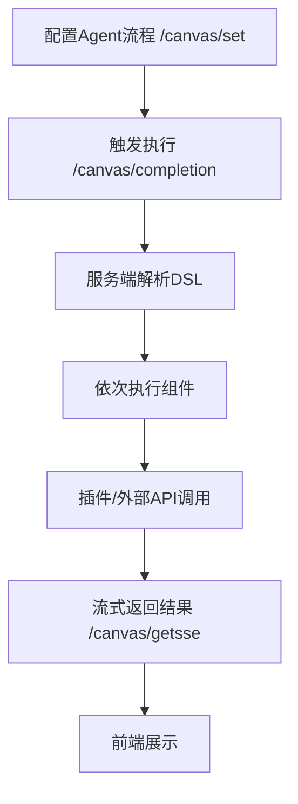
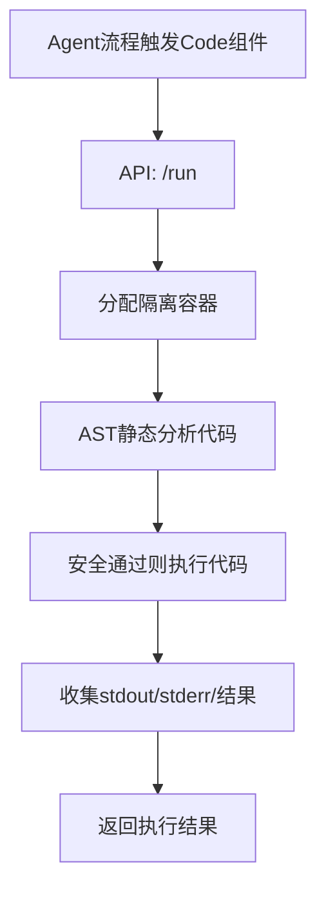
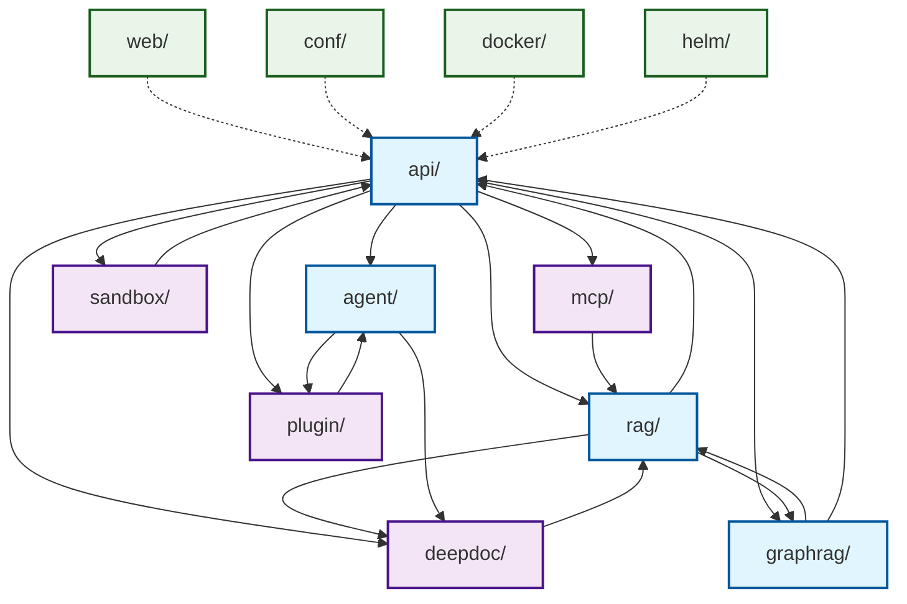

# 官方试用链接
https://ragflow.io/

# 分块策略详解
https://zhuanlan.zhihu.com/p/1886359804987036986
- General：无论是 DOCX、PPT 还是 HTML 等多种格式文件，它都能轻松搞定。自动帮你把文本切成合适大小的块，像是给文件做了一个精准的切片，方便后续操作。
- Q&A：要是碰上 excel 文件，两列摆好，问题答案分明；csv/txt 文件，编码和分隔符设置正确，它就能完美适配，让你的问答对轻松对应。
- Resume：简历处理更是不在话下，不管多乱的格式，一键就能结构化，像是给简历施了魔法，关键信息瞬间清晰。
- Manual：针对有分层结构的手册，它按照标题切片，同一部分的内容完整保留，块大小还能自定义，超灵活。
- Table：处理 csv/txt 表格文件，TAB 分隔、列标题明确，还能处理同义词，表格数据立马变得井井有条。
- Paper：论文处理超贴心，按章节切片，既方便理解又能减少计算成本，像是给论文装上了智能导航。
- Book：长篇书籍也不怕，设置好页码范围，负面影响直接消，分析时间大大节省。
- Laws：法律文件的严谨格式它能精准识别，以‘ARTICLE’为单位切片，上下文完整保留，法律条文处理超专业。
- Presentation：PPT 文件每个页面独立成块，缩略图还帮你存好，展示起来超方便。
- One：一个文档就是一个完整块，适合需要总结全文的情况，上下文全保留，总结起来超省心。
- Knowledge Graph：支持多种格式文件，切块后还能提取知识图谱，像是给文件装上了智能大脑，知识关联一目了然。
- Tag：用标签分类文件，查询时带上标签，相关内容轻松定位，文件管理超高效。

# 关于Graph
- 0.16.0版本中对Graph做了如下更新：
  - 关于Graph构造
    - 过去的GraphRAG为每个文档构建一个 Knowledge Graph，而0.16.0版本则为**每一个知识库构建一个Knowledge Graph**。单个文档可选择是否进行 Graph 实体抽取，抽取的Graph 实体会动态更新到知识图谱当中
    - 实体抽取可以有两种模式的选择，Light/General。Light 采用了 香港科大 LightRAG 的实体抽取 prompt，General 则采用了微软 GraphRAG 的 prompt，后者更长，耗费的 token 更多。抽取效果跟大模型和用户的数据相关，用户可以选择对比。
    - 实体去重 （Entity Resolution）变成可选项。在 0.9.0 版本引入的 GraphRAG 中，实体去重是内置的，在某些情况下，它确实提高了知识图谱的质量，但也增加了 token 消耗。在 GraphRAG 中，自动构造的知识图谱，通常无法达到数据可视化的要求，因此一般是作为辅助召回存在，所以把实体去重作为可选项，可以让用户来在知识图谱的质量和成本之间作出选择。
    - 社区摘要变成可选项。在微软的标准 GraphRAG 中， 社区摘要是一个必选项，它提升了辅助召回的问答质量，但也是 token 消耗的重要来源之一，因此变成可选项，可以让用户在效果和成本中作出选择。
  - 关于Graph召回
    - 查询时可以勾选是否需要提取知识图谱相关信息。如果勾选，查询过程变成了：
      1. 利用大模型对问题进行分析，提取相关的实体1和实体类型。
      2. 用相关的实体类型在知识图谱中做 PageRank 计算（随机游走），得到 PageRank 值前 N 的实体及其描述。
      3. 通过实体1的向量相似度召回相似实体及其描述，以及 N-hop 的实体关系。
      4. 通过原问题用向量相似度召回实体关系及其描述。
      5. 对实体和实体关系进行排序。排序理论支撑贝叶斯，P(E|Q) => P(E) * P(Q|E)，实体或关系本身的 PageRank 值乘以实体或关系和 Query/Question 的相似度。
      6. 用相关的实体召回 Top 1 社区摘要。
      7. 将实体和关系描述以及社区摘要报告作为 prompt 扔给大模型。
     
- RAGFlow中的Graph工作过程
  https://pic1.zhimg.com/v2-432dc724bff37ccb2f9a4d7e4fdfe5b6_1440w.jpg


  Graph构建入口：graphrag/general/index.py 的 run_graphrag()。过程是：
  1. 基于文档分片构建知识图谱，包括实体和关系的抽取，以及知识图谱的生成；
  2. 知识图谱合并，将新生成的知识图谱与原有知识图谱进行合并；
  3. 知识图谱的实体合并，减少实体重复，提升准确性；
  4. 基于知识图谱构建社区，包括社区构建与摘要生成；

 ## 关于实体抽取
  RAGFlow的Graph支持两种实体和关系提取方式：
  - Light：港大的LightRAG方式
  - General：微软的GraphRAG方式。
  两者区别影响的就是这部分抽取的prompt。
  1. General的实现方式
     - 通过精心设计的 prompt 和 Few-Shot 机制，利用大模型完成实体和关系的抽取。
     - graphrag/general/graph_extractor.py 中的 _process_single_content() 方法中完成
    
## 关于图谱生成与图谱合并
1. 图谱生成
  基于 networkx 生成知识图谱。调用 networkx 的 add_node() 和 add_edge() 方法实现，具体实现可参考 graphrag/general/index.py 中的 generate_subgraph() 方法。
2. 图谱合并
  graph_merge() 中完成，处理逻辑如下：
  - 节点存在时，将新节点的描述信息叠加至原有节点；
  - 关系存在时，将新关系的描述信息、权重和关键词叠加至原有关系；

## 关于实体合并
RagFlow 在 graphrag/entity_resolution.py 中实现实体合并。两步策略：
1. 初步相似度判断：使用编辑距离等工程手段筛选相似实体，基于 editdistance 实现；
2. 大模型相似度判断：确定最终的实体合并结果；

## 关于社区构建
社区构建基于 Leiden 算法实现，该算法通过模块度优化生成高质量的社区划分。实现位于 graphrag/general/leiden.py。
技术参考论文：https://arxiv.org/pdf/2404.16130
社区构建基于 graspologic 的 hierarchical_leiden 实现。

1. 社区摘要
社区摘要生成基于社区中实体和关系的描述信息，完全依赖大模型实现。通过精心设计的 prompt，生成能够代表社区核心内容的文本，提升检索和召回准确性。
相关 prompt 在 graphrag/general/community_report_prompt.py 中定义 

## 关于Graph的检索策略
graphrag/search.py 中实现。具体步骤：
1. 查询重写：调用 query_rewrite 方法，使用大模型提取问题中的实体类型关键词和实体；
2. 实体与关系检索：通过关键词和实体类型检索相关实体，通过原始问题检索相关关系；
3. 路径分析：从关键词检索到的实体出发，获取 N 跳邻居，实现相似度衰减；
3. 结果融合与评分：融合关键词检索、实体类型检索和关系检索结果，确定最终得分；
4. 结果排序与截断：按相似度和 PageRank 乘积排序，截取前 N 个结果；
5. 社区检索：调用 _community_retrival_() 方法检索相关社区报告；
6. 结果组合：将实体、关系和社区报告组合为最终结果；
         
# 关于标签
  - 标签库在 RAGFlow 中也作为知识库存在。需要上传标签文件，上传时Chunk选择TAG。
  - 支持标签可视化
  - 支持标签修改
  - 支持知识向量时，对业务知识每个Chunk根据标签库内容自动打标签。具体算法是利用 Chunk 和标签库文件的 Description/Question 字段文本的相似度，如果该相似度达到阈值，那么该 Chunk 就被打上 Tag 字段的各标签。
  - 在查询时，Query也会被自动打上不同权重的标签，计算方法跟上述类似，这样在排序阶段，包含相关标签的 Chunk 就会得到加权。

# 关于RAPTOR
https://arxiv.org/html/2401.18059v1
RAPTOR（用于树状组织检索的递归抽象处理）是一种增强型文档预处理技术，于2024年的一篇论文中提出。RAPTOR 旨在解决多跳问答问题，它对文档块执行递归聚类和摘要，以构建分层树状结构。
我们采用这种新方法进行的测试，在需要复杂、多步骤推理的问答任务中展现了最佳 (SOTA) 效果。通过将 RAPTOR 检索与我们内置的分块方法和/或其他检索增强生成 (RAG) 方法相结合，您可以进一步提升问答准确率。

过程是：将原始文档划分为多个块后，这些块将根据语义相似性（而非其在文本中的原始顺序）进行聚类。然后，系统默认的聊天模型会将聚类结果汇总为更高级别的块。此过程以递归方式应用，形成一个自下而上具有不同汇总级别的树形结构。如下图所示，初始块构成叶节点（以蓝色显示），并被递归汇总为根节点（以橙色显示）。
递归聚类和总结捕获了多跳问答所需的广泛理解（通过根节点）以及精细细节（通过叶节点）

# 其它弥补语音鸿沟的方法
  - RAPTOR，GraphRAG，Contextual Retrieval、标签

# 关于DeepDoc
在RAGFlow中，DeepDoc只用于PDF文档解析。
DeepDoc 是一个基于人工智能的文档智能分析平台，主要用于自动化处理和理解复杂的非结构化文档（如PDF、扫描件、合同、财务报表等）。它利用自然语言处理（NLP）、计算机视觉（OCR）和深度学习技术，从文档中提取关键信息、识别语义结构，并支持智能审核、数据录入自动化等应用场景。
主要功能可能包括：
高精度 OCR（光学字符识别），尤其适用于模糊或复杂版式文档
表格、段落、标题等结构化信息识别
合同条款抽取与比对
自动生成摘要或问答
支持多语言文档处理
这类系统常见于金融、法律、医疗、政务等领域，用于提升文档处理效率。

# 关于文档解析
文件解析通过接口 /v1/document/run。
api/db/services/task_service.py 中的 queue_tasks() 中完成的，此方法会根据文件创建一个或多个异步任务，方便异步执行。
文件的解析是根据内容拆分为多个任务，通过 Redis 消息队列进行暂存，之后就可以离线异步处理。

消息队列的消费模块，对应在 rag/svr/task_executor.py 中的 main() 方法中。
1. 调用 collect() 方法从消息队列中获取任务
2. 接下来每个任务会依次调用 build() 进行文件的解析
   - 根据 parser_id 去选择合适的解析器组，注意这个应该是从业务层得到的一个类型，每个解析器组中都包含了 pdf, word 等支持格式的文件解析
4. 调用 embedding() 方法进行向量化
5. 最后调用 ELASTICSEARCH.bulk() 写入 ElasticSearch，从这里就可以看到向量库的技术选型

文档预处理：
包含了不少了数据的清理操作，比如在 deepdoc/vision/layout_recognizer.py。

# 2. 代码解析

## 1. 总体架构与模块划分
主要目录结构如下：
|目录|主要功能|
|---|---|
|web|前端UI，支持知识库、Agent、文件、MCP等可视化管理与交互。 |
|conf|项目配置文件管理，包含Mysql、minio、ElasticSearch、Redis、MongoDB、OpenAI、LLM、MCP、RAGFlow、DeepDoc、GraphRAG、RAPTOR、Contextual Retrieval、标签、DeepDoc、文件解析、文档预处理、知识向量化、知识向量搜索、知识向量索引、知识向量检索、知识向量生成、知识向量更新、知识向量删除、知识向量查询、知识向量可视化、知识向量修改、知识向量上传、知识向|
|API|后端服务的Restful API定义，包含会话、知识库、文件、Agent等管理。|
|deepdoc| 各类文档的的解析器，深度文档解析，OCR、布局、表格结构识别等。 |
|graphrag| 主要用于知识图谱构建与检索。包括实体抽取、关系推理、图谱构建、社区发现、实体消歧、图谱搜索等。该模块为文档、知识库等内容提供结构化的图谱增强能力，提升智能检索、问答和推理效果。 |
|intergrations|用于存放与外部系统、第三方服务、云平台、插件等的集成适配代码。它让主项目能够无缝对接外部API、数据源、认证系统、消息队列、监控平台等，提升系统的开放性和扩展性。|
|sandox| sandbox目录就是RAGFlow的“安全代码执行引擎”，让用户/Agent提交的代码能在隔离、受控、可扩展的环境中安全运行，极大提升了系统的安全性和灵活性。|
|docker| docker目录就是RAGFlow项目的“运维/部署工具箱”，让你可以用最少的操作、最标准的方式，在任何主流服务器上快速、稳定、安全地部署和运行RAGFlow全套服务。|
|helm| 用于在Kubernetes集群中快速、安全地部署和运行RAGFlow全套服务。|
|docs|是RAGFlow项目的官方文档中心，面向用户、开发者和贡献者，提供了从快速入门、功能指南、API参考、配置说明、开发与贡献流程等全方位的文档资料。其目的是帮助用户高效上手、深入理解和灵活运用RAGFlow系统。|
|mcp| MCP协议服务端与客户端，支持跨系统模型上下文调用。 |


- **rag/**：RAG核心算法与文档处理，包括分块、嵌入、检索、提示词、NLP等。
- **agent/**：智能体（Agent）与工作流编排，支持无代码流程编辑、组件化任务流。

- **sdk/**：官方SDK，便于Python等语言集成RAGFlow能力。
- **plugin/**：插件机制，支持LLM工具扩展。
- **mcp/**：MCP协议服务端与客户端，支持跨系统模型上下文调用。
- **graphrag/**：图谱RAG，知识图谱抽取、融合、问答。
- **intergrations/**：第三方集成，如Chrome扩展、ChatGPT-on-WeChat插件等。
- **test/**、**example/**、**conf/**、**docs/**、**docker/**：测试、示例、配置、文档、容器化等辅助模块。

### web目录
前台微服务组件，采用的是是 React + UmiJS 框架。
运行方式：
```
  cd web
  npm install
  npm run dev
```
默认会在本地 http://localhost:8000 启动开发服务器（端口号可在 .umirc.ts 或 Umi 配置中修改）


### api目录
| 文件路径 | 主要功能解析 + 关键代码解析 |
|---|---|
| api/constants.py | **主要功能**：定义全局常量。<br>**关键代码**：如`SERVICE_CONF（配置文件名称）`、`NAME_LENGTH_LIMIT`、`IMG_BASE64_PREFIX`、`API_VERSION`、`RAG_FLOW_SERVICE_NAME`等。|
| api/settings.py | **主要功能**：全局配置管理，包括数据库、LLM、认证、文档引擎等。<br>**关键代码**：<br>- `init_settings()`：初始化全局变量，读取配置文件，设置LLM、数据库、文档引擎等。<br>- `get_or_create_secret_key()`：自动生成或读取SECRET_KEY。<br>- `RetCode`：定义通用返回码枚举。|
| api/versions.py | **主要功能**：获取RAGFlow的版本号。<br>**关键代码**：<br>- `get_ragflow_version()`：优先读取当前目录下VERSION文件，否则通过git标签获取最近的tag和commit数。支持slim/full版本区分。<br>- `get_closest_tag_and_count()`：用git命令获取最近tag。|
| api/validation.py | **主要功能**：校验Python版本并自动下载nltk数据。<br>**关键代码**：<br>- `python_version_validation()`：要求Python>=3.10，否则退出。<br>- `download_nltk_data()`：多进程下载nltk的wordnet和punkt_tab数据。|
| api/ragflow_server.py | **主要功能**：RAGFlow主服务启动入口，初始化日志、数据库、插件、信号处理、HTTP服务等。<br>**关键代码**：<br>- `update_progress()`：定时任务，使用Redis分布式锁更新文档进度。<br>- `signal_handler()`：优雅关闭服务。<br>- 主流程：初始化配置、数据库、插件，启动Flask HTTP服务。|
| api/__init__.py | **主要功能**：包初始化，自动为包内所有函数应用beartype类型检查。<br>**关键代码**：`beartype_this_package()`。|
| api/utils/web_utils.py | **主要功能**：Web相关工具函数，如html转pdf、内容类型映射、URL校验等。<br>**关键代码**：<br>- `html2pdf()`：用Selenium+Chrome Headless将HTML转为PDF。<br>- `is_valid_url()`：校验URL合法性及是否为私有IP。|
| api/utils/t_crypt.py | **主要功能**：基于RSA公钥加密字符串（如密码）。<br>**关键代码**：<br>- `crypt(line)`：读取公钥文件加密输入内容，返回base64编码。|
| api/utils/validation_utils.py | **主要功能**：基于Pydantic的请求参数校验、数据结构定义、错误格式化等。<br>**关键代码**：<br>- `validate_and_parse_json_request()`：多阶段校验JSON请求。<br>- `CreateDatasetReq`等数据模型，带丰富校验和注释。|
| api/utils/log_utils.py | **主要功能**：日志初始化与管理。<br>**关键代码**：<br>- `init_root_logger()`：配置日志文件、控制台输出、日志级别。<br>- `log_exception()`：统一异常日志输出。|
| api/utils/file_utils.py | **主要功能**：文件与目录操作、缩略图生成、配置文件读写、PDF修复等。<br>**关键代码**：<br>- `get_project_base_directory()`：获取项目根目录。<br>- `thumbnail_img()`：生成图片/PDF/PPT缩略图。<br>- `load_json_conf()`/`load_yaml_conf()`：加载配置文件。|
| api/utils/commands.py | **主要功能**：Flask CLI命令扩展，支持重置用户密码和邮箱。<br>**关键代码**：<br>- `reset_password`/`reset_email`：命令行交互重置用户信息，调用UserService。|
| api/utils/api_utils.py | **主要功能**：API通用工具，包含请求封装、参数校验、响应构造、权限校验、模型校验等。<br>**关键代码**：<br>- `request()`：带签名的HTTP请求。<br>- `validate_request`/`not_allowed_parameters`：装饰器参数校验。<br>- `token_required`/`apikey_required`：API权限校验。<br>- `verify_embedding_availability()`：校验embedding模型可用性。|
| api/utils/__init__.py | **主要功能**：通用工具函数，配置加载、加解密、序列化、时间处理等。<br>**关键代码**：<br>- `read_config()`/`get_base_config()`：加载合并全局配置。<br>- `decrypt_database_password()`/`decrypt_database_config()`：数据库密码解密。<br>- `CustomJSONEncoder`：自定义JSON序列化。|

**API/APP**下内容：
| 文件路径 | 主要功能介绍 | 主要RestAPI接口（如有） |
|---|---|---|
| api/apps/api_app.py | 核心API蓝本，聚合了会话、文件、知识库、对话、任务等多种业务的RESTful接口，支撑前端与后端的主要交互。 | 涉及如 `/v1/api/conversation/*`、`/v1/api/file/*`、`/v1/api/knowledgebase/*`、`/v1/api/dialog/*`、`/v1/api/task/*` 等大量API，具体包括会话管理、文件上传、知识库操作、对话流、任务调度等。 |
| api/apps/document_app.py | 文档管理相关API，负责文档的上传、解析、运行、重命名、删除、缩略图、web爬取、状态变更等。 | `/v1/document/upload`（上传文档）、`/v1/document/run`（运行/重置/取消文档解析）、`/v1/document/rename`、`/v1/document/rm`（删除）、`/v1/document/web_crawl`（网页转文档）、`/v1/document/parse`（解析URL）、`/v1/document/list`、`/v1/document/change_status`、`/v1/document/set_meta` 等。在知识库页面使用的是/v1/document/upload，通常会把文件直接作为“文档”上传到某个知识库，并支持后续解析、分块等操作。|
| api/apps/file_app.py | 文件管理API，处理文件的上传、下载、类型识别、缩略图生成、与知识库的关联等。 | `/v1/file/upload`、`/v1/file/download`、`/v1/file/thumbnail`、`/v1/file/link_to_dataset` 等。在文档管理页面使用的是/v1/file/upload，只是把文件存到系统里，未必直接关联到知识库或数据集。 |
| api/apps/knowledge_app.py | 知识库管理API，支持知识库的创建、查询、更新、删除、授权、标签管理等。 | `/v1/knowledge/create`、`/v1/knowledge/list`、`/v1/knowledge/update`、`/v1/knowledge/delete`、`/v1/knowledge/tag` 等。 |
| api/apps/datasets_app.py | 数据集管理API，支持数据集的创建、查询、更新、删除、权限管理等。 | `/v1/datasets/create`、`/v1/datasets/list`、`/v1/datasets/update`、`/v1/datasets/delete` 等。 |
| api/apps/agents_app.py | 智能体（Agent）管理API，支持Agent的创建、查询、更新、删除、模板管理等。 | `/v1/agents/create`、`/v1/agents/list`、`/v1/agents/update`、`/v1/agents/delete`、`/v1/agents/template` 等。 |
| api/apps/user_app.py | 用户管理API，支持用户注册、登录、信息修改、密码重置、团队管理、API密钥管理等。 | `/v1/user/register`、`/v1/user/login`、`/v1/user/profile`、`/v1/user/reset_password`、`/v1/user/team`、`/v1/user/api_key` 等。 |
| api/apps/system_app.py | 系统管理API，提供系统版本、健康检查、API Token管理等接口。 | `/v1/system/version`（获取系统版本）、`/v1/system/token`（API Token管理）等。 |
| api/apps/plugin_app.py | 插件相关API，主要用于获取和管理LLM插件工具。 | `/v1/plugin/llm_tools`（获取LLM插件工具列表）等。 |
| api/apps/mcp_server_app.py | 多计算节点（MCP）管理API，支持MCP服务器的注册、查询、工具调用等。 | `/v1/mcp_server/register`、`/v1/mcp_server/list`、`/v1/mcp_server/tools` 等。 |
| api/apps/langfuse_app.py | Langfuse相关API，通常用于日志、追踪、监控等功能。 | 具体接口视实现而定，如 `/v1/langfuse/log`、`/v1/langfuse/trace` 等。 |
| api/apps/file2document_app.py | 文件转文档相关API，支持文件与文档的关联、转换、状态管理等。 | `/v1/file2document/link`、`/v1/file2document/status` 等。 |
| api/apps/conversation_app.py | 会话管理API，支持会话的创建、查询、消息流、上下文管理等。 | `/v1/conversation/create`、`/v1/conversation/list`、`/v1/conversation/message` 等。 |
| api/apps/dialog_app.py | 对话流管理API，支持多轮对话、消息管理、上下文追踪等。 | `/v1/dialog/create`、`/v1/dialog/list`、`/v1/dialog/message` 等。 |
| api/apps/chunk_app.py | 文档分块管理API，支持文档分块的创建、查询、更新、删除等。 | `/v1/chunk/create`、`/v1/chunk/list`、`/v1/chunk/update`、`/v1/chunk/delete` 等。 |
| api/apps/canvas_app.py | 画布（Canvas）相关API，支持画布的创建、编辑、保存、协作等。 | `/v1/canvas/create`、`/v1/canvas/list`、`/v1/canvas/update`、`/v1/canvas/delete` 等。 |
| api/apps/llm_app.py | 大模型（LLM）管理API，支持模型的注册、查询、切换、授权等。 | `/v1/llm/register`、`/v1/llm/list`、`/v1/llm/switch`、`/v1/llm/authorize` 等。 |
| api/apps/search_app.py | 搜索相关API，支持全文检索、智能检索、结果聚合等。 | `/v1/search/query`、`/v1/search/aggregate` 等。 |
| api/apps/sdk/ | SDK专用API，供第三方或前端SDK调用，涵盖文件、会话、数据集、智能体等子模块。 | 如 `/v1/sdk/file/upload`、`/v1/sdk/session/ask`、`/v1/sdk/dataset/list`、`/v1/sdk/agent/create` 等。 |
| api/apps/auth/ | 认证与授权API，支持OAuth2、OIDC、GitHub等第三方登录，统一用户信息结构。 | `/v1/user/oauth/*`、`/v1/user/oidc/*`、`/v1/user/github/*` 等。 |

> 说明：  
> - RestAPI接口路径以 `/v1/xxx/yyy` 形式为主，实际前缀可能根据蓝图注册和API版本调整。  
> - 仅列举了常见和核心API，具体每个文件下的所有接口可通过源码或Swagger文档进一步查阅。  
> - 业务说明以“管理”、“创建”、“查询”、“上传”、“解析”等为主，涵盖RAGFlow系统的主要后端服务能力。


### deepdoc
| 路径 | 主要功能说明 |
|---|---|
| deepdoc/README.md, README_zh.md | DeepDoc整体介绍，分为视觉处理（OCR、布局识别、表结构识别）和多格式文档解析（PDF、DOCX、EXCEL、PPT、简历等）。详细说明了各模块用途和命令行用法。 |
| deepdoc/__init__.py | DeepDoc包初始化。 |
| deepdoc/vision/ocr.py | OCR核心实现，负责图像/PDF的文字识别。 |
| deepdoc/vision/t_ocr.py | **命令行入口**，批量对图片/PDF做OCR识别，输出识别文本和标注图片。对外接口：`python deepdoc/vision/t_ocr.py --inputs=... --output_dir=...` |
| deepdoc/vision/layout_recognizer.py | 布局识别核心实现，识别文档中的文本块、标题、表格、图片等布局元素。 |
| deepdoc/vision/t_recognizer.py | **命令行入口**，支持布局识别（layout）和表结构识别（tsr），输出标注图片和（表格时）HTML。对外接口：`python deepdoc/vision/t_recognizer.py --inputs=... --mode=layout/tsr --output_dir=...` |
| deepdoc/vision/table_structure_recognizer.py | 表结构识别核心实现，识别表格的行、列、表头、合并单元格等。 |
| deepdoc/vision/seeit.py | 可视化工具，绘制识别结果的标注框。 |
| deepdoc/vision/postprocess.py | 视觉识别结果的后处理。 |
| deepdoc/vision/operators.py | 视觉操作算子集合，支持多种视觉任务。 |
| deepdoc/vision/recognizer.py | 视觉识别通用框架。 |
| deepdoc/vision/__init__.py | 视觉模块初始化，导出OCR、布局识别等主要类。 |
| deepdoc/parser/pdf_parser.py | PDF文档解析器，负责PDF文本、表格、图片等结构化解析。 |
| deepdoc/parser/docx_parser.py | DOCX文档解析器。 |
| deepdoc/parser/excel_parser.py | EXCEL文档解析器。 |
| deepdoc/parser/ppt_parser.py | PPT文档解析器。 |
| deepdoc/parser/markdown_parser.py | Markdown文档解析器。 |
| deepdoc/parser/figure_parser.py | 图像/图表解析器。 |
| deepdoc/parser/html_parser.py | HTML文档解析器。 |
| deepdoc/parser/txt_parser.py | 纯文本解析器。 |
| deepdoc/parser/json_parser.py | JSON文档解析器。 |
| deepdoc/parser/utils.py | 解析器通用工具函数。 |
| deepdoc/parser/resume/ | 简历解析相关，分步处理简历文本为结构化数据。 |
| deepdoc/parser/resume/entities/ | 简历实体识别（如学校、公司、行业、地区、学位等），含丰富的实体资源文件。 |

---

**DeepDoc对外提供的接口**

| 接口/命令 | 作用 |
|---|---|
| `python deepdoc/vision/t_ocr.py --inputs=... --output_dir=...` | 对图片或PDF批量做OCR识别，输出识别文本和标注图片。 |
| `python deepdoc/vision/t_recognizer.py --inputs=... --mode=layout --output_dir=...` | 对图片或PDF做**布局识别**，输出布局标注图片。 |
| `python deepdoc/vision/t_recognizer.py --inputs=... --mode=tsr --output_dir=...` | 对图片或PDF做**表结构识别**，输出表格结构HTML和标注图片。 |

**作用说明：**
- 这些接口主要用于批量文档的视觉结构化处理，包括文字识别、版面分析、表格结构提取等，是后续文档解析、知识抽取、智能检索的基础。
- 解析器部分（如pdf_parser.py等）可作为Python模块被调用，实现多格式文档的结构化解析。

### graphrag
1）包含的所有文件功能说明
| 文件/目录 | 主要功能说明 |
|---|---|
| graphrag/search.py | 图谱搜索与查询相关核心逻辑，实现基于知识图谱的检索与推理。 |
| graphrag/utils.py | 图谱处理通用工具函数，包括图结构操作、数据处理等。 |
| graphrag/query_analyze_prompt.py | 查询分析相关的提示词（prompt）模板，辅助LLM理解和分析查询意图。 |
| graphrag/entity_resolution.py | 实体消歧与归一化算法，实现多源异构实体的统一识别。 |
| graphrag/entity_resolution_prompt.py | 实体消歧相关的prompt模板。 |
| graphrag/__init__.py | 包初始化。 |
---

2）子目录主要功能说明

| 子目录 | 主要功能说明 |
|---|---|
| light/ | 轻量级图谱抽取与推理相关实现，适用于快速、低资源消耗的场景。 |
| general/ | 通用型图谱抽取、社区发现、实体嵌入、思维导图等高级功能，适合复杂知识结构和大规模图谱处理。 |
---

3）light子目录
| 子目录 | 主要功能说明 |
|---|---|
| graphrag/light/graph_prompt.py | 轻量级图谱抽取与推理的prompt模板。 |
| graphrag/light/smoke.py | 轻量级图谱抽取/推理的测试与示例。 |
| graphrag/light/graph_extractor.py | 轻量级图谱结构抽取算法实现。 |
| graphrag/light/__init__.py | 子包初始化。 |
---

4）general子目录
| 子目录 | 主要功能说明 |
|---|---|
| graphrag/general/mind_map_extractor.py | 思维导图结构抽取算法。 |
| graphrag/general/mind_map_prompt.py | 思维导图相关prompt模板。 |
| graphrag/general/smoke.py | 通用图谱抽取/推理的测试与示例。 |
| graphrag/general/index.py | 通用图谱索引与管理。 |
| graphrag/general/leiden.py | 社区发现算法Leiden实现。 |
| graphrag/general/graph_extractor.py | 通用图谱结构抽取算法。 |
| graphrag/general/graph_prompt.py | 通用图谱抽取与推理的prompt模板。 |
| graphrag/general/community_reports_extractor.py | 社区报告抽取算法。 |
| graphrag/general/entity_embedding.py | 实体嵌入算法，实现实体向量化。 |
| graphrag/general/extractor.py | 通用实体/关系抽取算法。 |
| graphrag/general/community_report_prompt.py | 社区报告相关prompt模板。 |
| graphrag/general/__init__.py | 子包初始化。 |
---

### integrations
integrations目录 用于存放与外部系统、第三方服务、云平台、插件等的集成适配代码。它让主项目能够无缝对接外部API、数据源、认证系统、消息队列、监控平台等，提升系统的开放性和扩展性。

- integrations/slack/	集成Slack消息推送、通知、Bot等功能。
- integrations/feishu/	集成飞书消息、审批、Bot等功能。
- integrations/monitoring/	对接Prometheus、Grafana等监控系统。
- integrations/oss/	对接阿里云OSS、AWS S3等对象存储。
- integrations/auth/	对接OAuth、OIDC、LDAP等认证系统。
- integrations/webhook/	支持外部Webhook事件推送与接收。


### Agent
#### 主要API及流程
1. 前端通过 `/canvas/set` 配置Agent流程（DSL/图形化）。
2. 通过 `/canvas/completion` 触发Agent执行。
3. 服务端解析DSL，按依赖顺序依次执行各组件（如Retrieval、Generate、Code等）。
4. 支持分支、循环、插件工具、外部API调用。
5. 结果通过 `/canvas/getsse` 等接口流式返回。

#### 流程图


#### 关键活动说明
- **DSL/图形化编排**：支持拖拽、模板、变量、分支、循环。
- **组件执行**：每个组件（如Retrieval、Generate、Categorize、Code等）独立实现，支持扩展。
- **插件/外部API**：可调用LLM工具、MCP、沙箱等。
- **流式输出**：Agent每步结果可实时推送前端。


### docker
| 文件/目录 | 主要内容与功能说明 |
|---|---|
| docker/README.md | 详细介绍了Docker部署RAGFlow的环境变量、服务配置、docker-compose用法、HTTPS配置等。是部署和运维的说明文档。 |
| docker/docker-compose.yml | 主docker-compose编排文件，定义了RAGFlow及其依赖（如MySQL、Redis、MinIO、Elasticsearch等）的服务、网络、卷挂载等。 |
| docker/docker-compose-base.yml | 只包含RAGFlow依赖服务（不含RAGFlow本体），如Elasticsearch、MySQL、MinIO、Redis等，便于分步部署。 |
| docker/docker-compose-gpu.yml、docker-compose-gpu-CN-oc9.yml | 针对GPU环境的docker-compose配置，适用于需要GPU加速的场景。 |
| docker/docker-compose-macos.yml | 针对MacOS环境的docker-compose配置。 |
| docker/docker-compose-CN-oc9.yml | 针对中国区特定环境的docker-compose配置。 |
| docker/service_conf.yaml.template | RAGFlow主服务的系统级配置模板，包含数据库、对象存储、OAuth、LLM等配置。容器启动时会根据环境变量生成实际配置文件。 |
| docker/launch_backend_service.sh | 启动后端服务的Shell脚本，自动化初始化、配置和服务启动流程。 |
| docker/entrypoint.sh | 容器入口脚本，负责环境变量替换、配置生成、服务启动等。 |
| docker/init.sql | MySQL初始化脚本，创建数据库或表结构。 |
| docker/infinity_conf.toml | Infinity（向量数据库/检索服务）相关配置文件。 |
| docker/nginx/ | Nginx相关配置目录，包含主配置、代理配置、HTTPS配置等。 |
| docker/nginx/nginx.conf | Nginx主配置文件。 |
| docker/nginx/ragflow.conf | RAGFlow HTTP反向代理配置。 |
| docker/nginx/ragflow.https.conf | RAGFlow HTTPS反向代理配置。 |
| docker/nginx/proxy.conf | 代理通用配置片段。 |

---

**补充说明：**
- `docker-compose.yml` 及其变体文件用于一键启动RAGFlow及其依赖的全套服务，适配不同环境（如GPU、MacOS、中国区等）。
- `service_conf.yaml.template` 是RAGFlow后端服务的核心配置模板，实际运行时会被渲染为 `service_conf.yaml`。
- `nginx/` 目录下的配置文件用于前端反向代理、SSL终端、负载均衡等。
- 各种Shell脚本（如 `entrypoint.sh`、`launch_backend_service.sh`）实现了自动化部署、配置替换、服务初始化等功能。

### sandbox
| 文件/目录 | 主要内容与功能说明 |
|---|---|
| sandbox/README.md | 详细介绍了RAGFlow Sandbox的设计、功能、安全机制、依赖、部署和常见问题。强调其为RAGFlow及其他场景提供**安全、可插拔的代码执行后端**，支持多语言（Python/Node.js），基于gVisor实现系统调用级隔离，支持seccomp和AST静态分析双重安全防护。 |
| sandbox/docker-compose.yml | 定义了Sandbox相关服务（如sandbox-executor-manager等）的容器编排，便于一键部署和管理。 |
| sandbox/Makefile | 提供一系列自动化命令（如build、start、stop、test等），简化开发、构建、测试和运维流程。 |
| sandbox/pyproject.toml | Python项目依赖和元数据管理文件。 |
| sandbox/uv.lock | Python依赖锁定文件，确保依赖环境一致性。 |
| sandbox/scripts/ | 启动、停止、重启等Shell脚本，辅助服务管理。 |
| sandbox/tests/ | 安全性和功能性测试用例，验证沙箱隔离和代码执行安全。 |
| sandbox/sandbox_base_image/ | 各语言（如Python、Node.js）沙箱基础镜像的Dockerfile和依赖，便于扩展和自定义运行环境。 |
| sandbox/executor_manager/ | 核心执行管理服务，实现代码任务的调度、隔离、运行和安全控制。 |
| sandbox/asserts/ | 架构图等静态资源。 |

---

**sandbox目录的作用是：为RAGFlow等系统提供一个高安全、可扩展的“代码沙箱”服务，支持多语言代码的受控执行，防止恶意代码危害主系统。**

- 通过gVisor和可选seccomp实现系统级隔离，防止容器逃逸和权限提升。
- 支持Python/Node.js等多语言，便于AI Agent、插件等场景下的安全代码执行。
- 提供自动化部署、测试、依赖管理和安全配置，方便开发者和运维人员使用。
- 可独立运行，也可与RAGFlow主服务集成，实现“代码即服务”的安全执行环境。

**调用场景**
1. Agent流程中包含 `Code` 组件时，后端通过 `/run` API 调用沙箱服务。
2. 沙箱服务分配隔离容器，静态分析代码安全性，执行后返回结果。

**流程图**


**关键活动说明**
- **多语言支持**：目前支持Python、Node.js等。
- **gVisor隔离**：系统调用级安全隔离，防止逃逸。
- **AST分析**：静态检测危险操作，提前阻断。
- **资源限制**：内存、CPU、超时等多重限制。


# 3. 业务流程分析
## 1.2 文件上传、切片与向量化、图谱构建流程
### 1）API入口

- **文件上传API**  
  - `/v1/document/upload`（知识库文档上传，推荐用于知识增强流程）
    - 目录：`api/apps/`
    - 文件：`document_app.py`
    - 主要函数：`upload()`
  - `/v1/document/parse`（知识库文档上传，手工启动解析）
    - 目录：`api/apps/`
    - 文件：`document_app.py`
    - 主要函数：`parse()`
  - `/v1/document/upload_and_parse`（上传并立即解析，常用于对话/Agent场景）
    - 目录：`api/apps/`
    - 文件：`document_app.py`
    - 主要函数：`upload_and_parse()`
  - `/v1/file/upload`（原始文件上传，非知识库归档流程）

---
### 2）模块调用关系与关键函数位置

| 步骤 | 主要函数 | 所在目录 | 所在文件 |
|---|---|---|---|
| 文件归档/存储 | `FileService.upload_document` | `api/db/services/` | `file_service.py` |
| Document元数据生成 | `DocumentService.insert` | `api/db/services/` | `document_service.py` |
| 解析任务入队 | `TaskService.queue_tasks` | `api/db/services/` | `task_service.py` |
| 文档解析与切片 | 各解析器的`chunk`方法（如`naive.chunk`、`presentation.chunk`等） | `rag/app/` | `naive.py`、`presentation.py`等 |
| 切片内容向量化 | `LLMBundle.encode` | `api/db/services/` | `llm_service.py` |
| 向量入库 | `settings.docStoreConn.insert` | `api/settings.py`（对象）/ `rag/utils/`（实现） | `es_conn.py`、`infinity_conn.py`等 |
| 图谱构造 | `MindMapExtractor` | `graphrag/general/` | `mind_map_extractor.py` |

---

## 3）调用链举例（以 `/v1/document/upload_and_parse` 为例）

1. `api/apps/document_app.py`  
   - `upload_and_parse()`  
     → 调用 `doc_upload_and_parse()`（`api/db/services/document_service.py`）

2. `api/db/services/document_service.py`  
   - `doc_upload_and_parse()`  
     1. 调用 `FileService.upload_document()`（`api/db/services/file_service.py`）  
      - 调用 `FileService.get_parser()` 根据文件类型选择解析器
     2. 归档后，调用各解析器的`chunk`方法进行切片  
       - 根据知识库配置获取Embedding模型实例
         ```python
         embd_mdl = LLMBundle(kb.tenant_id, LLMType.EMBEDDING, llm_name=kb.embd_id, lang=kb.language)
         ```
       - 创建解析器工厂
         ```python
         FACTORY = {
           ParserType.PRESENTATION.value: presentation,
           ParserType.PICTURE.value: picture,
           ParserType.AUDIO.value: audio,
           ParserType.EMAIL.value: email
         }
         ```
       - 多线程解析处理
         ```python
            threads.append(exe.submit(FACTORY.get(d["parser_id"], naive).chunk, d["name"], blob, **kwargs))
         ```
      3. 获取切片结果
        - 遍历每个文件的解析结果
        - 为每个切片生成唯一ID（基于内容哈希）
        - 处理图片：如果有图片，保存到存储系统
        - 构建切片数据结构
      4. 对切片结果向量化
        - 调用 `embd_mdl.encode()` 进行向量化
      5. 构建知识图谱（思维导图方式）
        - 对非图片类型的文档构建知识图谱
        - 使用 `MindMapExtractor` 提取思维导图 `graphrag/general/mind_map_extractor.py`
        - 调用 `settings.docStoreConn.insert()` 向量入库，使用的是ES图数据看

3. 解析器的Chunk，以presentation为例
   - 目录：`rag/app/`  
   - 文件：如`naive.py`、`presentation.py`等，具体由`parser_id`决定

4. 知识图谱的构建
   1. 服务器启动后1秒，启动一个守护线程，每6秒执行一次 `update_progress()`
      **位置**: `api/ragflow_server.py:51-66`
      **函数**: `update_progress()`
   2. `update_progress`处理逻辑
      - 获取创建完成的文档
      - 创建构造知识图谱异步任务
        ```python
        if finished and bad:
          prg = -1
          status = TaskStatus.FAIL.value
        elif finished:
          if (d["parser_config"].get("raptor") or {}).get("use_raptor") and not has_raptor:
            queue_raptor_o_graphrag_tasks(d, "raptor", priority)
            prg = 0.98 * len(tsks) / (len(tsks) + 1)
          elif (d["parser_config"].get("graphrag") or {}).get("use_graphrag") and not has_graphrag:
            queue_raptor_o_graphrag_tasks(d, "graphrag", priority)
            prg = 0.98 * len(tsks) / (len(tsks) + 1)
          else:
            status = TaskStatus.DONE.value
        ```
    3. 构建知识图谱的异步任务
      **位置**: `rag/svr/task_executor.py:513-579`
      **函数**: `do_handle_task()`
      ```python
      # Either using RAPTOR or Standard chunking methods
      if task.get("task_type", "") == "raptor":
        # bind LLM for raptor
        chat_model = LLMBundle(task_tenant_id, LLMType.CHAT, llm_name=task_llm_id, lang=task_language)
        await is_strong_enough(chat_model, None)
        # run RAPTOR
        async with kg_limiter:
            chunks, token_count = await run_raptor(task, chat_model, embedding_model, vector_size, progress_callback)
      # Either using graphrag or Standard chunking methods
      elif task.get("task_type", "") == "graphrag":
        if not task_parser_config.get("graphrag", {}).get("use_graphrag", False):
          progress_callback(prog=-1.0, msg="Internal configuration error.")
          return
        graphrag_conf = task["kb_parser_config"].get("graphrag", {})
        start_ts = timer()
        chat_model = LLMBundle(task_tenant_id, LLMType.CHAT, llm_name=task_llm_id, lang=task_language)
        await is_strong_enough(chat_model, None)
        with_resolution = graphrag_conf.get("resolution", False)
        with_community = graphrag_conf.get("community", False)
        async with kg_limiter:
          await run_graphrag(task, task_language, with_resolution, with_community, chat_model, embedding_model, progress_callback)
        progress_callback(prog=1.0, msg="Knowledge Graph done ({:.2f}s)".format(timer() - start_ts))
        return
      ```
      调用run_graphrag()执行图谱构造
    
    4. 启动图谱构造
      **位置**: `graphrag/general/index.py:62-65`
      根据**解析器配置中 method**判断采用Light方式构造，还是默认General方式构造
      ```python
      subgraph = await generate_subgraph(
        LightKGExt
        if "method" not in row["kb_parser_config"].get("graphrag", {}) or row["kb_parser_config"]["graphrag"]["method"] != "general"
        else GeneralKGExt,
        tenant_id,
        kb_id,
        doc_id,
        chunks,
        language,
        row["kb_parser_config"]["graphrag"].get("entity_types", []),
        chat_model,
        embedding_model,
        callback,
      )
      ```
      执行过程效用关系：
      ```
      --> run_graphrag() 跟模配置指定使用LightKGExt 还是 GeneralKGExt
      --> 基类Extractor的__call__()
      --> Light_Extractor：_process_single_content（）
      --> run_graphrag() -> merge_subgraph() ->set_graph() 连接图数据库保存Graph
      ```
---

## 4）流程图（函数与文件标注）

```mermaid
flowchart TD
    A[api/apps/document_app.py<br>upload_and_parse()] 
      --> B[api/db/services/document_service.py<br>doc_upload_and_parse()]
    B --> C[api/db/services/file_service.py<br>FileService.upload_document()]
    B --> D[rag/app/naive.py等<br>chunk()]
    B --> E[api/db/services/llm_service.py<br>LLMBundle.encode()]
    B --> F[graphrag/general/mind_map_extractor.py<br>MindMapExtractor]
    B --> G[api/settings.py<br>settings.docStoreConn.insert()]
```

---

## 5）关键活动说明（含文件定位）

- **文件归档/存储**  
  - `api/db/services/file_service.py` → `FileService.upload_document`
- **Document元数据生成**  
  - `api/db/services/document_service.py` → `DocumentService.insert`
- **解析任务入队**  
  - `api/db/services/task_service.py` → `TaskService.queue_tasks`
- **文档解析与切片**  
  - `rag/app/naive.py`、`rag/app/presentation.py`等 → `chunk`方法
- **向量化**  
  - `api/db/services/llm_service.py` → `LLMBundle.encode`
- **向量入库**  
  - `api/settings.py`（对象）/ `rag/utils/es_conn.py`等（实现） → `settings.docStoreConn.insert`
- **图谱构造**  
  - `graphrag/general/mind_map_extractor.py` → `MindMapExtractor`

---


## 4）关键活动说明

- **文件归档/存储**  
  - 文件被存储到对象存储（如MinIO），并生成唯一存储路径。
  - 生成缩略图（如PDF首页、图片缩略图）并存储。

- **Document元数据生成**  
  - 记录文档ID、知识库ID、解析器类型、文件名、存储位置、大小、缩略图等信息，写入数据库。

- **解析任务入队**  
  - 根据文档类型和解析配置，生成解析任务（如PDF按页、Excel按行切分）。
  - 任务入队到任务队列（如Redis），等待异步处理。

- **文档解析与切片**  
  - 解析器（如PDFParser、ExcelParser等）将文档内容切分为多个“切片”。
  - 每个切片包含文本内容、位置信息、权重等。

- **向量化**  
  - 对每个切片内容调用Embedding模型（如LLM Embedding），生成向量。
  - 向量与切片元数据一起写入向量检索引擎（如Elasticsearch、Infinity）。

- **图谱构造**  
  - 对切片内容进行实体/关系抽取，生成知识图谱结构（如思维导图、实体关系网）。
  - 图谱结构作为特殊切片或独立结构入库，供后续检索和推理使用。

---


## 3.2 对话与知识库问答
## 1）API入口

- `/v1/chat/completions`
  - 目录：`api/apps/`
  - 文件：`chat_app.py`
  - 主要函数：`chat_completions()`

- `/v1/chat/chat`
  - 目录：`api/apps/`
  - 文件：`chat_app.py`
  - 主要函数：`chat()`

---

## 2）模块调用关系与关键函数位置

| 步骤 | 主要函数 | 所在目录 | 所在文件 |
|---|---|---|---|
| 用户问题接收 | `chat_completions()` | `api/apps/` | `chat_app.py` |
| 问题预处理 | `ChatService.chat_completions` | `api/db/services/` | `chat_service.py` |
| 知识库检索 | `RetrieverService.retrieve` | `api/db/services/` | `retriever_service.py` |
| 向量相似度搜索 | `settings.docStoreConn.search` | `api/settings.py`（对象）/ `rag/utils/`（实现） | `es_conn.py`、`infinity_conn.py`等 |
| 上下文组装 | `ChatService._build_context` | `api/db/services/` | `chat_service.py` |
| LLM推理 | `LLMBundle.chat` | `api/db/services/` | `llm_service.py` |
| 流式响应 | `ChatService._stream_response` | `api/db/services/` | `chat_service.py` |
| 对话历史记录 | `ChatService._save_chat_history` | `api/db/services/` | `chat_service.py` |

---

## 3）调用链举例（以 `/v1/chat/completions` 为例）

1. `api/apps/chat_app.py`  
   - `chat_completions()`  
     → 调用 `ChatService.chat_completions()`（`api/db/services/chat_service.py`）

2. `api/db/services/chat_service.py`  
   - `chat_completions()`  
     → 调用 `RetrieverService.retrieve()`（`api/db/services/retriever_service.py`）进行知识检索  
     → 调用 `settings.docStoreConn.search()` 进行向量相似度搜索  
     → 调用 `_build_context()` 组装上下文  
     → 调用 `LLMBundle.chat()`（`api/db/services/llm_service.py`）进行LLM推理  
     → 调用 `_stream_response()` 处理流式响应  
     → 调用 `_save_chat_history()` 保存对话历史

3. 知识检索实现  
   - 目录：`api/db/services/`  
   - 文件：`retriever_service.py`

4. 向量搜索实现  
   - 目录：`rag/utils/`  
   - 文件：`es_conn.py`、`infinity_conn.py`等，具体由配置决定

5. LLM推理实现  
   - 目录：`api/db/services/`  
   - 文件：`llm_service.py`

---

## 4）流程图（函数与文件标注）

```mermaid
flowchart TD
    A[api/apps/chat_app.py<br>chat_completions()] 
      --> B[api/db/services/chat_service.py<br>ChatService.chat_completions()]
    B --> C[api/db/services/retriever_service.py<br>RetrieverService.retrieve()]
    C --> D[api/settings.py<br>settings.docStoreConn.search()]
    B --> E[api/db/services/chat_service.py<br>_build_context()]
    B --> F[api/db/services/llm_service.py<br>LLMBundle.chat()]
    B --> G[api/db/services/chat_service.py<br>_stream_response()]
    B --> H[api/db/services/chat_service.py<br>_save_chat_history()]
```

---

## 5）关键活动说明（含文件定位）

- **用户问题接收**  
  - `api/apps/chat_app.py` → `chat_completions()`
- **问题预处理**  
  - `api/db/services/chat_service.py` → `ChatService.chat_completions`
- **知识库检索**  
  - `api/db/services/retriever_service.py` → `RetrieverService.retrieve`
- **向量相似度搜索**  
  - `api/settings.py`（对象）/ `rag/utils/es_conn.py`等（实现） → `settings.docStoreConn.search`
- **上下文组装**  
  - `api/db/services/chat_service.py` → `_build_context`
- **LLM推理**  
  - `api/db/services/llm_service.py` → `LLMBundle.chat`
- **流式响应**  
  - `api/db/services/chat_service.py` → `_stream_response`
- **对话历史记录**  
  - `api/db/services/chat_service.py` → `_save_chat_history`

---

## 6）详细流程说明

1. **问题接收阶段**  
   - 用户通过前端发送问题到 `/v1/chat/completions`
   - `api/apps/chat_app.py` 接收请求并调用 `ChatService`

2. **知识检索阶段**  
   - `api/db/services/retriever_service.py` 负责从知识库中检索相关内容
   - 调用向量数据库进行相似度搜索，获取最相关的文档片段

3. **上下文组装阶段**  
   - `api/db/services/chat_service.py` 中的 `_build_context()` 方法
   - 将检索到的知识片段与用户问题组装成完整的上下文

4. **LLM推理阶段**  
   - `api/db/services/llm_service.py` 中的 `LLMBundle.chat()` 方法
   - 使用配置的LLM模型进行推理生成答案

5. **响应处理阶段**  
   - `api/db/services/chat_service.py` 中的 `_stream_response()` 方法
   - 处理流式响应，实时返回给前端

6. **历史记录阶段**  
   - `api/db/services/chat_service.py` 中的 `_save_chat_history()` 方法
   - 保存对话历史到数据库

---

# 5. 各目录之依赖拓扑图

---

## 2）目录间依赖关系详解

### 2.1 API模块依赖关系

| 源目录 | 源文件 | 目标目录 | 目标文件 | 依赖说明 |
|---|---|---|---|---|
| `api/apps/` | `document_app.py` | `api/db/services/` | `document_service.py` | 文档服务调用 |
| `api/apps/` | `document_app.py` | `api/db/services/` | `file_service.py` | 文件服务调用 |
| `api/apps/` | `document_app.py` | `rag/utils/` | `storage_factory.py` | 存储工厂调用 |
| `api/apps/` | `document_app.py` | `deepdoc/parser/` | `html_parser.py` | HTML解析器 |
| `api/apps/` | `chat_app.py` | `api/db/services/` | `chat_service.py` | 聊天服务调用 |
| `api/apps/` | `chat_app.py` | `api/db/services/` | `retriever_service.py` | 检索服务调用 |
| `api/apps/` | `api_app.py` | `agent/canvas.py` | `Canvas` | Agent画布调用 |
| `api/apps/` | `canvas_app.py` | `agent/canvas.py` | `Canvas` | Agent画布调用 |
| `api/db/services/` | `document_service.py` | `graphrag/general/` | `mind_map_extractor.py` | 思维导图提取 |
| `api/db/services/` | `file_service.py` | `rag/app/` | `naive.py` | 文档解析器 |
| `api/db/services/` | `file_service.py` | `rag/app/` | `presentation.py` | PPT解析器 |
| `api/db/services/` | `file_service.py` | `rag/app/` | `picture.py` | 图片解析器 |
| `api/db/services/` | `file_service.py` | `rag/app/` | `audio.py` | 音频解析器 |
| `api/db/services/` | `file_service.py` | `rag/app/` | `email.py` | 邮件解析器 |
| `api/utils/` | `api_utils.py` | `rag/utils/` | `mcp_tool_call_conn.py` | MCP工具调用 |
| `api/settings.py` | `settings.py` | `rag/nlp/` | `search.py` | 搜索功能 |
| `api/ragflow_server.py` | `ragflow_server.py` | `api/db/services/` | `document_service.py` | 文档服务 |

### 2.2 RAG模块依赖关系

| 源目录 | 源文件 | 目标目录 | 目标文件 | 依赖说明 |
|---|---|---|---|---|
| `rag/svr/` | `task_executor.py` | `api/db/services/` | `document_service.py` | 文档服务 |
| `rag/svr/` | `task_executor.py` | `api/db/services/` | `llm_service.py` | LLM服务 |
| `rag/svr/` | `task_executor.py` | `api/db/services/` | `task_service.py` | 任务服务 |
| `rag/svr/` | `task_executor.py` | `graphrag/general/` | `index.py` | 图谱构建 |
| `rag/svr/` | `task_executor.py` | `rag/app/` | `naive.py` | 文档解析 |
| `rag/svr/` | `task_executor.py` | `rag/app/` | `presentation.py` | PPT解析 |
| `rag/svr/` | `task_executor.py` | `rag/app/` | `manual.py` | 手册解析 |
| `rag/svr/` | `task_executor.py` | `rag/app/` | `laws.py` | 法律文档解析 |
| `rag/svr/` | `task_executor.py` | `rag/app/` | `paper.py` | 论文解析 |
| `rag/svr/` | `task_executor.py` | `rag/app/` | `book.py` | 书籍解析 |
| `rag/svr/` | `task_executor.py` | `rag/app/` | `resume.py` | 简历解析 |
| `rag/svr/` | `task_executor.py` | `rag/app/` | `table.py` | 表格解析 |
| `rag/svr/` | `task_executor.py` | `rag/app/` | `qa.py` | 问答解析 |
| `rag/svr/` | `task_executor.py` | `rag/app/` | `one.py` | 单文档解析 |
| `rag/svr/` | `task_executor.py` | `rag/app/` | `audio.py` | 音频解析 |
| `rag/svr/` | `task_executor.py` | `rag/app/` | `email.py` | 邮件解析 |
| `rag/svr/` | `task_executor.py` | `rag/app/` | `picture.py` | 图片解析 |
| `rag/svr/` | `task_executor.py` | `rag/app/` | `tag.py` | 标签解析 |
| `rag/app/` | `naive.py` | `deepdoc/parser/` | `pdf_parser.py` | PDF解析 |
| `rag/app/` | `naive.py` | `deepdoc/parser/` | `docx_parser.py` | DOCX解析 |
| `rag/app/` | `naive.py` | `deepdoc/parser/` | `excel_parser.py` | Excel解析 |
| `rag/app/` | `naive.py` | `deepdoc/parser/` | `html_parser.py` | HTML解析 |
| `rag/app/` | `naive.py` | `deepdoc/parser/` | `json_parser.py` | JSON解析 |
| `rag/app/` | `naive.py` | `deepdoc/parser/` | `markdown_parser.py` | Markdown解析 |
| `rag/app/` | `naive.py` | `deepdoc/parser/` | `txt_parser.py` | 文本解析 |
| `rag/app/` | `picture.py` | `deepdoc/vision/` | `ocr.py` | OCR识别 |
| `rag/app/` | `presentation.py` | `deepdoc/parser/` | `ppt_parser.py` | PPT解析 |
| `rag/app/` | `resume.py` | `deepdoc/parser/resume/` | `step_one.py` | 简历解析步骤1 |
| `rag/app/` | `resume.py` | `deepdoc/parser/resume/` | `step_two.py` | 简历解析步骤2 |
| `rag/app/` | `table.py` | `deepdoc/parser/` | `excel_parser.py` | Excel表格解析 |
| `rag/app/` | `qa.py` | `deepdoc/parser/` | `pdf_parser.py` | PDF问答解析 |
| `rag/app/` | `qa.py` | `deepdoc/parser/` | `excel_parser.py` | Excel问答解析 |
| `rag/app/` | `qa.py` | `deepdoc/parser/` | `docx_parser.py` | DOCX问答解析 |
| `rag/app/` | `manual.py` | `deepdoc/parser/` | `pdf_parser.py` | PDF手册解析 |
| `rag/app/` | `manual.py` | `deepdoc/parser/` | `docx_parser.py` | DOCX手册解析 |
| `rag/app/` | `manual.py` | `deepdoc/parser/` | `plain_parser.py` | 纯文本手册解析 |
| `rag/app/` | `paper.py` | `deepdoc/parser/` | `pdf_parser.py` | PDF论文解析 |
| `rag/app/` | `paper.py` | `deepdoc/parser/` | `plain_parser.py` | 纯文本论文解析 |
| `rag/app/` | `book.py` | `deepdoc/parser/` | `pdf_parser.py` | PDF书籍解析 |
| `rag/app/` | `book.py` | `deepdoc/parser/` | `docx_parser.py` | DOCX书籍解析 |
| `rag/app/` | `book.py` | `deepdoc/parser/` | `html_parser.py` | HTML书籍解析 |
| `rag/app/` | `laws.py` | `deepdoc/parser/` | `pdf_parser.py` | PDF法律文档解析 |
| `rag/app/` | `laws.py` | `deepdoc/parser/` | `docx_parser.py` | DOCX法律文档解析 |
| `rag/app/` | `laws.py` | `deepdoc/parser/` | `html_parser.py` | HTML法律文档解析 |
| `rag/app/` | `email.py` | `deepdoc/parser/` | `html_parser.py` | HTML邮件解析 |
| `rag/app/` | `email.py` | `deepdoc/parser/` | `txt_parser.py` | 文本邮件解析 |
| `rag/app/` | `one.py` | `deepdoc/parser/` | `pdf_parser.py` | PDF单文档解析 |
| `rag/app/` | `one.py` | `deepdoc/parser/` | `excel_parser.py` | Excel单文档解析 |
| `rag/app/` | `one.py` | `deepdoc/parser/` | `html_parser.py` | HTML单文档解析 |
| `rag/app/` | `one.py` | `deepdoc/parser/` | `plain_parser.py` | 纯文本单文档解析 |
| `rag/app/` | `tag.py` | `deepdoc/parser/` | `utils.py` | 解析工具 |
| `rag/app/` | `tag.py` | `graphrag/utils/` | `get_tags_from_cache.py` | 标签缓存 |
| `rag/app/` | `tag.py` | `graphrag/utils/` | `set_tags_to_cache.py` | 标签缓存设置 |
| `rag/llm/` | `chat_model.py` | `rag/nlp/` | `is_chinese.py` | 中文检测 |
| `rag/llm/` | `chat_model.py` | `rag/nlp/` | `is_english.py` | 英文检测 |
| `rag/llm/` | `cv_model.py` | `rag/nlp/` | `is_english.py` | 英文检测 |
| `rag/llm/` | `cv_model.py` | `rag/prompts/` | `vision_llm_describe_prompt.py` | 视觉描述提示 |
| `rag/llm/` | `embedding_model.py` | `api/utils/` | `file_utils.py` | 文件工具 |
| `rag/llm/` | `embedding_model.py` | `api/utils/` | `log_utils.py` | 日志工具 |
| `rag/llm/` | `rerank_model.py` | `api/utils/` | `file_utils.py` | 文件工具 |
| `rag/llm/` | `rerank_model.py` | `api/utils/` | `log_utils.py` | 日志工具 |
| `rag/llm/` | `sequence2txt_model.py` | `rag/utils/` | `num_tokens_from_string.py` | Token计数 |
| `rag/llm/` | `tts_model.py` | `rag/utils/` | `num_tokens_from_string.py` | Token计数 |
| `rag/nlp/` | `search.py` | `rag/utils/` | `doc_store_conn.py` | 文档存储连接 |
| `rag/nlp/` | `search.py` | `rag/utils/` | `rmSpace.py` | 空格处理 |
| `rag/nlp/` | `search.py` | `rag/utils/` | `get_float.py` | 浮点数处理 |
| `rag/nlp/` | `query.py` | `rag/utils/` | `doc_store_conn.py` | 文档存储连接 |
| `rag/nlp/` | `query.py` | `rag/nlp/` | `rag_tokenizer.py` | RAG分词器 |
| `rag/nlp/` | `query.py` | `rag/nlp/` | `term_weight.py` | 词权重 |
| `rag/nlp/` | `query.py` | `rag/nlp/` | `synonym.py` | 同义词 |
| `rag/nlp/` | `term_weight.py` | `api/utils/` | `file_utils.py` | 文件工具 |
| `rag/nlp/` | `synonym.py` | `api/utils/` | `file_utils.py` | 文件工具 |
| `rag/nlp/` | `rag_tokenizer.py` | `api/utils/` | `file_utils.py` | 文件工具 |
| `rag/utils/` | `es_conn.py` | `api/utils/` | `file_utils.py` | 文件工具 |
| `rag/utils/` | `es_conn.py` | `rag/settings/` | `TAG_FLD.py` | 标签字段 |
| `rag/utils/` | `es_conn.py` | `rag/settings/` | `PAGERANK_FLD.py` | 页面排名字段 |
| `rag/utils/` | `infinity_conn.py` | `api/utils/` | `file_utils.py` | 文件工具 |
| `rag/utils/` | `infinity_conn.py` | `rag/settings/` | `PAGERANK_FLD.py` | 页面排名字段 |
| `rag/utils/` | `opensearch_conn.py` | `api/utils/` | `file_utils.py` | 文件工具 |
| `rag/utils/` | `opensearch_conn.py` | `rag/settings/` | `TAG_FLD.py` | 标签字段 |
| `rag/utils/` | `opensearch_conn.py` | `rag/settings/` | `PAGERANK_FLD.py` | 页面排名字段 |
| `rag/utils/` | `mcp_tool_call_conn.py` | `api/db/` | `MCPServerType.py` | MCP服务器类型 |
| `rag/utils/` | `mcp_tool_call_conn.py` | `rag/llm/` | `chat_model.py` | 聊天模型 |
| `rag/utils/` | `tavily_conn.py` | `api/utils/` | `get_uuid.py` | UUID生成 |
| `rag/utils/` | `tavily_conn.py` | `rag/nlp/` | `rag_tokenizer.py` | RAG分词器 |
| `rag/utils/` | `storage_factory.py` | `rag/utils/` | `azure_sas_conn.py` | Azure SAS连接 |
| `rag/utils/` | `storage_factory.py` | `rag/utils/` | `azure_spn_conn.py` | Azure SPN连接 |
| `rag/utils/` | `storage_factory.py` | `rag/utils/` | `minio_conn.py` | MinIO连接 |
| `rag/utils/` | `storage_factory.py` | `rag/utils/` | `opendal_conn.py` | OpenDAL连接 |
| `rag/utils/` | `storage_factory.py` | `rag/utils/` | `s3_conn.py` | S3连接 |
| `rag/utils/` | `storage_factory.py` | `rag/utils/` | `oss_conn.py` | OSS连接 |
| `rag/settings.py` | `settings.py` | `api/utils/` | `get_base_config.py` | 基础配置 |
| `rag/settings.py` | `settings.py` | `api/utils/` | `decrypt_database_config.py` | 数据库配置解密 |
| `rag/settings.py` | `settings.py` | `api/utils/` | `file_utils.py` | 文件工具 |
| `rag/prompts.py` | `prompts.py` | `api/db/services/` | `document_service.py` | 文档服务 |
| `rag/prompts.py` | `prompts.py` | `api/db/` | `LLMType.py` | LLM类型 |
| `rag/prompts.py` | `prompts.py` | `api/db/services/` | `llm_service.py` | LLM服务 |
| `rag/raptor.py` | `raptor.py` | `api/utils/` | `api_utils.py` | API工具 |
| `rag/raptor.py` | `raptor.py` | `graphrag/utils/` | `get_llm_cache.py` | LLM缓存 |
| `rag/raptor.py` | `raptor.py` | `graphrag/utils/` | `set_llm_cache.py` | LLM缓存设置 |
| `rag/raptor.py` | `raptor.py` | `graphrag/utils/` | `get_embed_cache.py` | 嵌入缓存 |
| `rag/raptor.py` | `raptor.py` | `graphrag/utils/` | `set_embed_cache.py` | 嵌入缓存设置 |
| `rag/raptor.py` | `raptor.py` | `graphrag/utils/` | `chat_limiter.py` | 聊天限制器 |
| `rag/raptor.py` | `raptor.py` | `rag/utils/` | `truncate.py` | 截断工具 |

### 2.3 GraphRAG模块依赖关系

| 源目录 | 源文件 | 目标目录 | 目标文件 | 依赖说明 |
|---|---|---|---|---|
| `graphrag/general/` | `index.py` | `api/` | `settings.py` | API设置 |
| `graphrag/general/` | `index.py` | `api/utils/` | `get_uuid.py` | UUID生成 |
| `graphrag/general/` | `index.py` | `api/utils/` | `api_utils.py` | API工具 |
| `graphrag/general/` | `index.py` | `graphrag/light/` | `graph_extractor.py` | Light图谱提取器 |
| `graphrag/general/` | `index.py` | `graphrag/general/` | `graph_extractor.py` | General图谱提取器 |
| `graphrag/general/` | `index.py` | `graphrag/general/` | `community_reports_extractor.py` | 社区报告提取器 |
| `graphrag/general/` | `index.py` | `graphrag/entity_resolution.py` | `entity_resolution.py` | 实体解析 |
| `graphrag/general/` | `index.py` | `graphrag/general/` | `extractor.py` | 基础提取器 |
| `graphrag/general/` | `index.py` | `graphrag/utils/` | `graph_merge.py` | 图谱合并 |
| `graphrag/general/` | `index.py` | `graphrag/utils/` | `get_graph.py` | 获取图谱 |
| `graphrag/general/` | `index.py` | `graphrag/utils/` | `set_graph.py` | 设置图谱 |
| `graphrag/general/` | `index.py` | `graphrag/utils/` | `chunk_id.py` | 块ID |
| `graphrag/general/` | `index.py` | `graphrag/utils/` | `does_graph_contains.py` | 图谱包含检查 |
| `graphrag/general/` | `index.py` | `graphrag/utils/` | `tidy_graph.py` | 图谱整理 |
| `graphrag/general/` | `index.py` | `graphrag/utils/` | `GraphChange.py` | 图谱变更 |
| `graphrag/general/` | `index.py` | `rag/nlp/` | `rag_tokenizer.py` | RAG分词器 |
| `graphrag/general/` | `index.py` | `rag/nlp/` | `search.py` | 搜索功能 |
| `graphrag/general/` | `index.py` | `rag/utils/` | `redis_conn.py` | Redis连接 |
| `graphrag/general/` | `extractor.py` | `api/utils/` | `api_utils.py` | API工具 |
| `graphrag/general/` | `extractor.py` | `rag/llm/` | `chat_model.py` | 聊天模型 |
| `graphrag/general/` | `extractor.py` | `rag/prompts/` | `message_fit_in.py` | 消息适配 |
| `graphrag/general/` | `extractor.py` | `rag/utils/` | `truncate.py` | 截断工具 |
| `graphrag/general/` | `graph_extractor.py` | `rag/llm/` | `chat_model.py` | 聊天模型 |
| `graphrag/general/` | `graph_extractor.py` | `rag/utils/` | `num_tokens_from_string.py` | Token计数 |
| `graphrag/general/` | `graph_extractor.py` | `graphrag/general/` | `extractor.py` | 基础提取器 |
| `graphrag/general/` | `graph_extractor.py` | `graphrag/general/` | `graph_prompt.py` | 图谱提示 |
| `graphrag/general/` | `graph_extractor.py` | `graphrag/utils/` | `ErrorHandlerFn.py` | 错误处理 |
| `graphrag/general/` | `graph_extractor.py` | `graphrag/utils/` | `perform_variable_replacements.py` | 变量替换 |
| `graphrag/general/` | `graph_extractor.py` | `graphrag/utils/` | `chat_limiter.py` | 聊天限制器 |
| `graphrag/general/` | `graph_extractor.py` | `graphrag/utils/` | `split_string_by_multi_markers.py` | 字符串分割 |
| `graphrag/general/` | `mind_map_extractor.py` | `graphrag/general/` | `extractor.py` | 基础提取器 |
| `graphrag/general/` | `mind_map_extractor.py` | `graphrag/general/` | `mind_map_prompt.py` | 思维导图提示 |
| `graphrag/general/` | `mind_map_extractor.py` | `graphrag/utils/` | `ErrorHandlerFn.py` | 错误处理 |
| `graphrag/general/` | `mind_map_extractor.py` | `graphrag/utils/` | `perform_variable_replacements.py` | 变量替换 |
| `graphrag/general/` | `mind_map_extractor.py` | `graphrag/utils/` | `chat_limiter.py` | 聊天限制器 |
| `graphrag/general/` | `community_reports_extractor.py` | `api/utils/` | `api_utils.py` | API工具 |
| `graphrag/general/` | `community_reports_extractor.py` | `rag/llm/` | `chat_model.py` | 聊天模型 |
| `graphrag/general/` | `community_reports_extractor.py` | `rag/utils/` | `num_tokens_from_string.py` | Token计数 |
| `graphrag/general/` | `community_reports_extractor.py` | `graphrag/general/` | `leiden.py` | Leiden算法 |
| `graphrag/general/` | `community_reports_extractor.py` | `graphrag/general/` | `community_report_prompt.py` | 社区报告提示 |
| `graphrag/general/` | `community_reports_extractor.py` | `graphrag/general/` | `extractor.py` | 基础提取器 |
| `graphrag/general/` | `community_reports_extractor.py` | `graphrag/general/` | `leiden.py` | Leiden算法 |
| `graphrag/general/` | `community_reports_extractor.py` | `graphrag/utils/` | `perform_variable_replacements.py` | 变量替换 |
| `graphrag/general/` | `community_reports_extractor.py` | `graphrag/utils/` | `dict_has_keys_with_types.py` | 字典键类型检查 |
| `graphrag/general/` | `community_reports_extractor.py` | `graphrag/utils/` | `chat_limiter.py` | 聊天限制器 |
| `graphrag/light/` | `graph_extractor.py` | `rag/llm/` | `chat_model.py` | 聊天模型 |
| `graphrag/light/` | `graph_extractor.py` | `rag/utils/` | `num_tokens_from_string.py` | Token计数 |
| `graphrag/light/` | `graph_extractor.py` | `graphrag/general/` | `extractor.py` | 基础提取器 |
| `graphrag/light/` | `graph_extractor.py` | `graphrag/light/` | `graph_prompt.py` | Light图谱提示 |
| `graphrag/light/` | `graph_extractor.py` | `graphrag/utils/` | `pack_user_ass_to_openai_messages.py` | OpenAI消息打包 |
| `graphrag/light/` | `graph_extractor.py` | `graphrag/utils/` | `split_string_by_multi_markers.py` | 字符串分割 |
| `graphrag/light/` | `graph_extractor.py` | `graphrag/utils/` | `chat_limiter.py` | 聊天限制器 |
| `graphrag/utils/` | `utils.py` | `api/utils/` | `api_utils.py` | API工具 |
| `graphrag/utils/` | `utils.py` | `api/utils/` | `get_uuid.py` | UUID生成 |
| `graphrag/utils/` | `utils.py` | `rag/nlp/` | `search.py` | 搜索功能 |
| `graphrag/utils/` | `utils.py` | `rag/nlp/` | `rag_tokenizer.py` | RAG分词器 |
| `graphrag/utils/` | `utils.py` | `rag/utils/` | `doc_store_conn.py` | 文档存储连接 |
| `graphrag/utils/` | `utils.py` | `rag/utils/` | `redis_conn.py` | Redis连接 |
| `graphrag/search.py` | `search.py` | `api/utils/` | `get_uuid.py` | UUID生成 |
| `graphrag/search.py` | `search.py` | `rag/utils/` | `num_tokens_from_string.py` | Token计数 |
| `graphrag/search.py` | `rag/utils/` | `get_float.py` | 浮点数处理 |
| `graphrag/search.py` | `rag/utils/` | `doc_store_conn.py` | 文档存储连接 |
| `graphrag/search.py` | `rag/nlp/` | `search.py` | 搜索功能 |
| `graphrag/search.py` | `api/db/` | `LLMType.py` | LLM类型 |
| `graphrag/search.py` | `api/db/services/` | `knowledgebase_service.py` | 知识库服务 |
| `graphrag/search.py` | `api/db/services/` | `llm_service.py` | LLM服务 |
| `graphrag/search.py` | `api/db/services/` | `user_service.py` | 用户服务 |
| `graphrag/search.py` | `rag/nlp/` | `search.py` | 搜索功能 |
| `graphrag/entity_resolution.py` | `entity_resolution.py` | `graphrag/general/` | `extractor.py` | 基础提取器 |
| `graphrag/entity_resolution.py` | `entity_resolution.py` | `graphrag/entity_resolution_prompt.py` | 实体解析提示 |
| `graphrag/entity_resolution.py` | `graphrag/utils/` | `perform_variable_replacements.py` | 变量替换 |
| `graphrag/entity_resolution.py` | `graphrag/utils/` | `chat_limiter.py` | 聊天限制器 |
| `graphrag/entity_resolution.py` | `graphrag/utils/` | `GraphChange.py` | 图谱变更 |

### 2.4 Agent模块依赖关系

| 源目录 | 源文件 | 目标目录 | 目标文件 | 依赖说明 |
|---|---|---|---|---|
| `agent/canvas.py` | `canvas.py` | `agent/component/` | `component.py` | 组件管理 |
| `agent/canvas.py` | `canvas.py` | `agent/component/` | `base.py` | 基础组件 |
| `agent/component/` | `generate.py` | `plugin/` | `llm_tool_plugin.py` | LLM工具插件 |
| `agent/component/` | `invoke.py` | `deepdoc/parser/` | `html_parser.py` | HTML解析器 |
| `agent/component/` | `exesql.py` | `agent/component/` | `generate.py` | 生成组件 |
| `agent/component/` | `categorize.py` | `agent/component/` | `generate.py` | 生成组件 |
| `agent/component/` | `rewrite.py` | `agent/component/` | `generate.py` | 生成组件 |
| `agent/component/` | `relevant.py` | `agent/component/` | `generate.py` | 生成组件 |
| `agent/component/` | `keyword.py` | `agent/component/` | `generate.py` | 生成组件 |
| `agent/component/` | `base.py` | `agent/canvas.py` | `Canvas` | 画布（避免循环依赖） |

### 2.5 DeepDoc模块依赖关系

| 源目录 | 源文件 | 目标目录 | 目标文件 | 依赖说明 |
|---|---|---|---|---|
| `deepdoc/parser/` | `pdf_parser.py` | `deepdoc/vision/` | `ocr.py` | OCR识别 |
| `deepdoc/parser/` | `pdf_parser.py` | `deepdoc/vision/` | `layout_recognizer.py` | 布局识别 |
| `deepdoc/parser/` | `pdf_parser.py` | `deepdoc/vision/` | `recognizer.py` | 识别器 |
| `deepdoc/parser/` | `pdf_parser.py` | `deepdoc/vision/` | `table_structure_recognizer.py` | 表格结构识别 |
| `deepdoc/parser/` | `pdf_parser.py` | `rag/app/` | `picture.py` | 图片处理 |
| `deepdoc/parser/` | `pdf_parser.py` | `rag/nlp/` | `rag_tokenizer.py` | RAG分词器 |
| `deepdoc/parser/` | `pdf_parser.py` | `rag/prompts/` | `vision_llm_describe_prompt.py` | 视觉描述提示 |
| `deepdoc/parser/` | `resume/step_one.py` | `deepdoc/parser/resume/` | `entities.py` | 实体定义 |
| `deepdoc/parser/` | `resume/step_two.py` | `deepdoc/parser/resume/` | `entities.py` | 实体定义 |
| `deepdoc/vision/` | `layout_recognizer.py` | `deepdoc/vision/` | `recognizer.py` | 识别器 |
| `deepdoc/vision/` | `layout_recognizer.py` | `deepdoc/vision/` | `operators.py` | 操作符 |
| `deepdoc/vision/` | `layout_recognizer.py` | `deepdoc/vision/` | `dla_cli.py` | DLA客户端 |
| `deepdoc/vision/` | `t_ocr.py` | `deepdoc/vision/` | `seeit.py` | 可视化 |
| `deepdoc/vision/` | `t_ocr.py` | `deepdoc/vision/` | `ocr.py` | OCR识别 |
| `deepdoc/vision/` | `t_recognizer.py` | `deepdoc/vision/` | `seeit.py` | 可视化 |
| `deepdoc/vision/` | `t_recognizer.py` | `deepdoc/vision/` | `layout_recognizer.py` | 布局识别 |
| `deepdoc/vision/` | `t_recognizer.py` | `deepdoc/vision/` | `table_structure_recognizer.py` | 表格结构识别 |
| `deepdoc/vision/` | `t_recognizer.py` | `deepdoc/vision/` | `ocr.py` | OCR识别 |

### 2.6 MCP模块依赖关系

| 源目录 | 源文件 | 目标目录 | 目标文件 | 依赖说明 |
|---|---|---|---|---|
| `mcp/server/` | `server.py` | `mcp/server/` | `lowlevel.py` | 底层服务器 |
| `mcp/server/` | `server.py` | `mcp/server/` | `sse.py` | SSE服务器传输 |
| `mcp/server/` | `server.py` | `mcp/server/` | `streamable_http_manager.py` | 流式HTTP管理器 |
| `mcp/client/` | `streamable_http_client.py` | `mcp/client/` | `streamable_http.py` | 流式HTTP客户端 |
| `mcp/client/` | `client.py` | `mcp/client/` | `session.py` | 会话管理 |
| `mcp/client/` | `client.py` | `mcp/client/` | `sse.py` | SSE客户端 |

### 2.7 Plugin模块依赖关系

| 源目录 | 源文件 | 目标目录 | 目标文件 | 依赖说明 |
|---|---|---|---|---|
| `plugin/embedded_plugins/llm_tools/` | `bad_calculator.py` | `plugin/` | `llm_tool_plugin.py` | LLM工具插件基类 |

### 2.8 Sandbox模块依赖关系

| 源目录 | 源文件 | 目标目录 | 目标文件 | 依赖说明 |
|---|---|---|---|---|
| `sandbox/executor_manager/` | `main.py` | `api/routes/` | `router.py` | API路由 |
| `sandbox/executor_manager/` | `api/routes.py` | `api/handlers/` | `healthz_handler.py` | 健康检查处理器 |
| `sandbox/executor_manager/` | `api/routes.py` | `api/handlers/` | `run_code_handler.py` | 代码运行处理器 |

---

## 3）依赖拓扑图



---

# 6. 前后台API调用关系

## 1. 团队管理相关API

### 1.1 租户管理
- **URI**: `/v1/tenant/list` - 获取租户列表
- **URI**: `/v1/tenant/{tenantId}/user` - 添加租户用户
- **URI**: `/v1/tenant/{tenantId}/user/list` - 获取租户用户列表
- **URI**: `/v1/tenant/{tenantId}/user/{userId}` - 删除租户用户
- **URI**: `/v1/tenant/agree/{tenantId}` - 同意租户邀请

---

## 2. 用户管理相关API

### 2.1 用户认证
- **URI**: `/v1/user/login` - 用户登录
- **URI**: `/v1/user/logout` - 用户登出  
- **URI**: `/v1/user/register` - 用户注册
- **URI**: `/v1/user/info` - 获取用户信息
- **URI**: `/v1/user/setting` - 用户设置
- **URI**: `/v1/user/tenant_info` - 获取租户信息
- **URI**: `/v1/user/set_tenant_info` - 设置租户信息

### 2.2 第三方登录
- **URI**: `/v1/user/login/channels` - 获取登录渠道
- **URI**: `/v1/user/login/{channel}` - 特定渠道登录

---

## 3. LLM模型管理相关API

### 3.1 模型配置
- **URI**: `/v1/llm/factories` - 获取模型工厂列表
- **URI**: `/v1/llm/list` - 获取LLM列表
- **URI**: `/v1/llm/my_llms` - 获取我的LLM模型
- **URI**: `/v1/llm/set_api_key` - 设置API密钥
- **URI**: `/v1/llm/add_llm` - 添加LLM模型
- **URI**: `/v1/llm/delete_llm` - 删除LLM模型
- **URI**: `/v1/llm/delete_factory` - 删除模型工厂

---

## 4. 插件管理相关API

### 4.1 工具插件
- **URI**: `/v1/plugin/llm_tools` - 获取LLM工具列表

---

## 5. 知识库管理相关API

### 5.1 知识库操作
- **URI**: `/v1/kb/list` - 获取知识库列表
- **URI**: `/v1/kb/create` - 创建知识库
- **URI**: `/v1/kb/update` - 更新知识库
- **URI**: `/v1/kb/rm` - 删除知识库
- **URI**: `/v1/kb/detail` - 获取知识库详情
- **URI**: `/v1/kb/{knowledgeId}/knowledge_graph` - 获取知识图谱

### 5.2 标签管理
- **URI**: `/v1/kb/{knowledgeId}/tags` - 获取标签列表
- **URI**: `/v1/kb/tags` - 根据知识库ID获取标签
- **URI**: `/v1/kb/{knowledgeId}/rm_tags` - 删除标签
- **URI**: `/v1/kb/{knowledgeId}/rename_tag` - 重命名标签

---

## 6. 文档切片管理相关API

### 6.1 切片操作
- **URI**: `/v1/chunk/list` - 获取切片列表
- **URI**: `/v1/chunk/create` - 创建切片
- **URI**: `/v1/chunk/set` - 设置切片
- **URI**: `/v1/chunk/get` - 获取切片详情
- **URI**: `/v1/chunk/switch` - 切换切片状态
- **URI**: `/v1/chunk/rm` - 删除切片
- **URI**: `/v1/chunk/retrieval_test` - 检索测试
- **URI**: `/v1/chunk/knowledge_graph` - 切片知识图谱

---

## 7. 文档管理相关API

### 7.1 文档操作
- **URI**: `/v1/document/list` - 获取文档列表
- **URI**: `/v1/document/change_status` - 修改文档状态
- **URI**: `/v1/document/rm` - 删除文档
- **URI**: `/v1/document/rename` - 重命名文档
- **URI**: `/v1/document/create` - 创建文档
- **URI**: `/v1/document/run` - 运行文档
- **URI**: `/v1/document/change_parser` - 修改解析器
- **URI**: `/v1/document/thumbnails` - 获取文档缩略图
- **URI**: `/v1/document/get` - 获取文档文件
- **URI**: `/v1/document/upload` - 上传文档
- **URI**: `/v1/document/web_crawl` - 网页爬取
- **URI**: `/v1/document/infos` - 获取文档信息
- **URI**: `/v1/document/upload_and_parse` - 上传并解析
- **URI**: `/v1/document/parse` - 解析文档
- **URI**: `/v1/document/set_meta` - 设置文档元数据
- **URI**: `/v1/document/filter` - 获取数据集过滤器

---

## 8. 聊天对话相关API

### 8.1 对话管理
- **URI**: `/v1/dialog/set` - 设置对话
- **URI**: `/v1/dialog/get` - 获取对话
- **URI**: `/v1/dialog/rm` - 删除对话
- **URI**: `/v1/dialog/list` - 获取对话列表

### 8.2 会话管理
- **URI**: `/v1/conversation/set` - 设置会话
- **URI**: `/v1/conversation/get` - 获取会话
- **URI**: `/v1/conversation/getsse` - 获取会话SSE流
- **URI**: `/v1/conversation/list` - 获取会话列表
- **URI**: `/v1/conversation/rm` - 删除会话
- **URI**: `/v1/conversation/completion` - 会话补全
- **URI**: `/v1/conversation/delete_msg` - 删除消息
- **URI**: `/v1/conversation/thumbup` - 点赞
- **URI**: `/v1/conversation/tts` - 文本转语音
- **URI**: `/v1/conversation/ask` - 问答
- **URI**: `/v1/conversation/mindmap` - 思维导图
- **URI**: `/v1/conversation/related_questions` - 相关问题

### 8.3 外部API
- **URI**: `/v1/api/new_token` - 创建外部Token
- **URI**: `/v1/api/token_list` - 获取Token列表
- **URI**: `/v1/api/rm` - 删除Token
- **URI**: `/v1/api/stats` - 获取统计信息
- **URI**: `/v1/api/new_conversation` - 创建外部会话
- **URI**: `/v1/api/conversation` - 获取外部会话
- **URI**: `/v1/api/completion` - 外部会话补全
- **URI**: `/v1/api/document/upload_and_parse` - 外部文档上传解析

---

## 9. 文件管理相关API

### 9.1 文件操作
- **URI**: `/v1/file/list` - 获取文件列表
- **URI**: `/v1/file/upload` - 上传文件
- **URI**: `/v1/file/rm` - 删除文件
- **URI**: `/v1/file/rename` - 重命名文件
- **URI**: `/v1/file/all_parent_folder` - 获取所有父文件夹
- **URI**: `/v1/file/create` - 创建文件夹
- **URI**: `/v1/file/get` - 获取文件
- **URI**: `/v1/file/mv` - 移动文件

### 9.2 文件转换
- **URI**: `/v1/file2document/convert` - 文件转文档

---

## 10. 系统管理相关API

### 10.1 系统信息
- **URI**: `/v1/system/version` - 获取系统版本
- **URI**: `/v1/system/status` - 获取系统状态
- **URI**: `/v1/system/config` - 获取系统配置

### 10.2 Token管理
- **URI**: `/v1/system/token_list` - 获取系统Token列表
- **URI**: `/v1/system/new_token` - 创建系统Token
- **URI**: `/v1/system/token` - 删除系统Token

### 10.3 监控配置
- **URI**: `/v1/langfuse/api_key` - Langfuse API密钥配置

---

## 11. 工作流/Agent相关API

### 11.1 画布管理
- **URI**: `/v1/canvas/templates` - 获取模板列表
- **URI**: `/v1/canvas/list` - 获取画布列表
- **URI**: `/v1/canvas/listteam` - 获取团队画布列表
- **URI**: `/v1/canvas/get` - 获取画布详情
- **URI**: `/v1/canvas/getsse` - 获取画布SSE流
- **URI**: `/v1/canvas/rm` - 删除画布
- **URI**: `/v1/canvas/set` - 设置画布
- **URI**: `/v1/canvas/setting` - 画布设置
- **URI**: `/v1/canvas/reset` - 重置画布
- **URI**: `/v1/canvas/completion` - 运行画布
- **URI**: `/v1/canvas/debug` - 调试画布
- **URI**: `/v1/canvas/upload` - 上传画布文件
- **URI**: `/v1/canvas/trace` - 画布追踪
- **URI**: `/v1/canvas/input_form` - 获取输入表单

### 11.2 版本管理
- **URI**: `/v1/canvas/getlistversion` - 获取版本列表
- **URI**: `/v1/canvas/getversion` - 获取版本详情

### 11.3 数据库连接
- **URI**: `/v1/canvas/test_db_connect` - 测试数据库连接
- **URI**: `/v1/canvas/input_elements` - 获取输入元素

---

## 12. MCP服务器相关API

### 12.1 服务器管理
- **URI**: `/v1/mcp_server/list` - 获取MCP服务器列表
- **URI**: `/v1/mcp_server/detail` - 获取MCP服务器详情
- **URI**: `/v1/mcp_server/create` - 创建MCP服务器
- **URI**: `/v1/mcp_server/update` - 更新MCP服务器
- **URI**: `/v1/mcp_server/rm` - 删除MCP服务器
- **URI**: `/v1/mcp_server/test_mcp` - 测试MCP服务器

### 12.2 导入导出
- **URI**: `/v1/mcp_server/import` - 导入MCP服务器
- **URI**: `/v1/mcp_server/export` - 导出MCP服务器

### 12.3 工具管理
- **URI**: `/v1/mcp_server/list_tools` - 获取工具列表
- **URI**: `/v1/mcp_server/test_tool` - 测试工具
- **URI**: `/v1/mcp_server/cache_tools` - 缓存工具