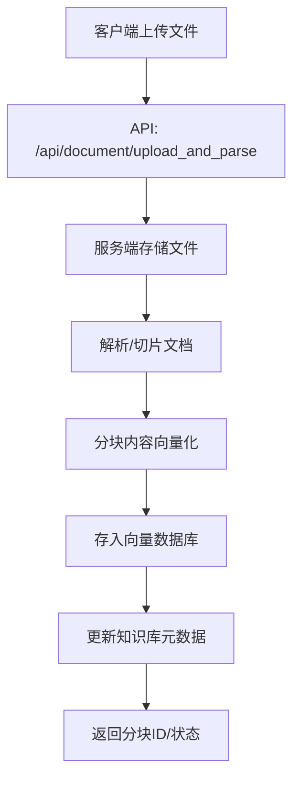
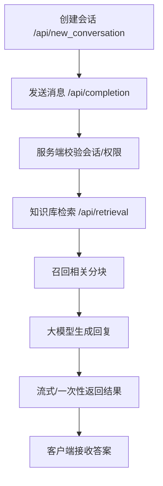
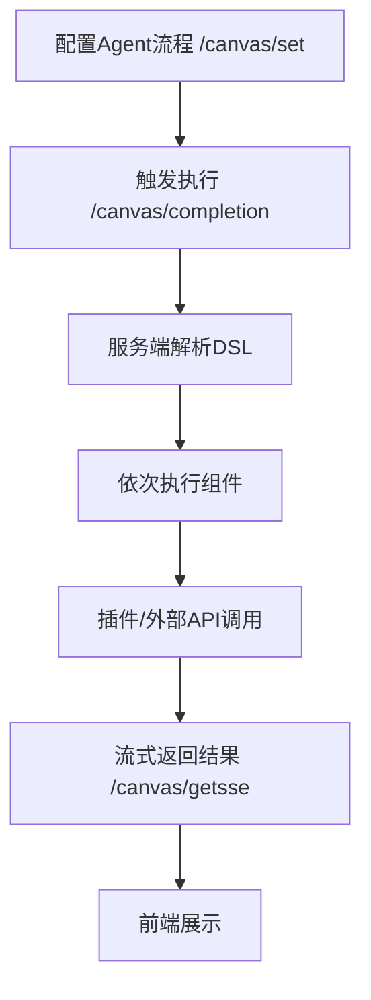
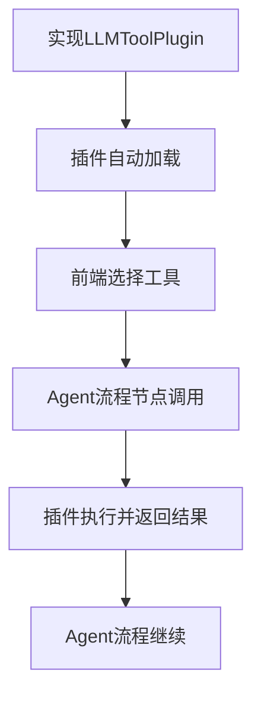
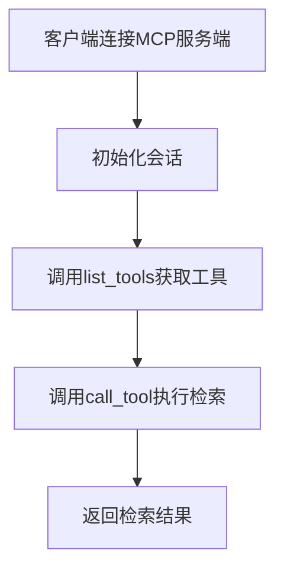
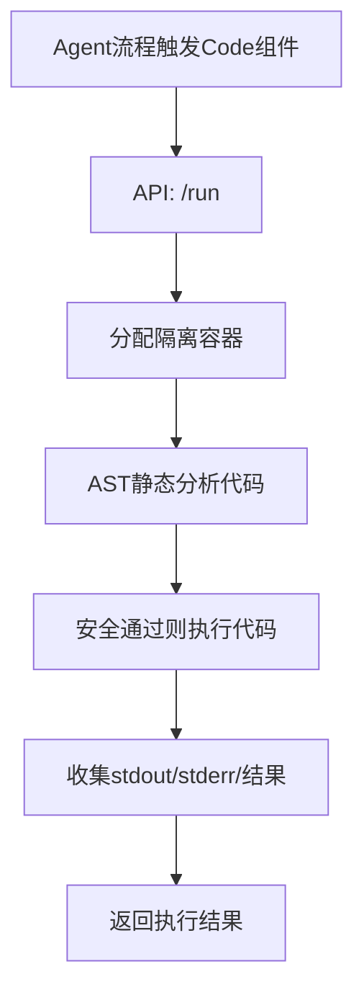
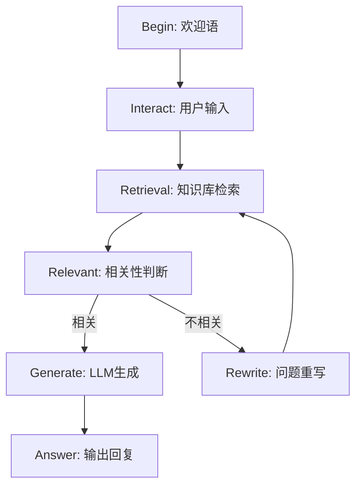

# 官方试用链接
https://ragflow.io/

# 分块策略详解
https://zhuanlan.zhihu.com/p/1886359804987036986
- General：无论是 DOCX、PPT 还是 HTML 等多种格式文件，它都能轻松搞定。自动帮你把文本切成合适大小的块，像是给文件做了一个精准的切片，方便后续操作。
- Q&A：要是碰上 excel 文件，两列摆好，问题答案分明；csv/txt 文件，编码和分隔符设置正确，它就能完美适配，让你的问答对轻松对应。
- Resume：简历处理更是不在话下，不管多乱的格式，一键就能结构化，像是给简历施了魔法，关键信息瞬间清晰。
- Manual：针对有分层结构的手册，它按照标题切片，同一部分的内容完整保留，块大小还能自定义，超灵活。
- Table：处理 csv/txt 表格文件，TAB 分隔、列标题明确，还能处理同义词，表格数据立马变得井井有条。
- Paper：论文处理超贴心，按章节切片，既方便理解又能减少计算成本，像是给论文装上了智能导航。
- Book：长篇书籍也不怕，设置好页码范围，负面影响直接消，分析时间大大节省。
- Laws：法律文件的严谨格式它能精准识别，以‘ARTICLE’为单位切片，上下文完整保留，法律条文处理超专业。
- Presentation：PPT 文件每个页面独立成块，缩略图还帮你存好，展示起来超方便。
- One：一个文档就是一个完整块，适合需要总结全文的情况，上下文全保留，总结起来超省心。
- Knowledge Graph：支持多种格式文件，切块后还能提取知识图谱，像是给文件装上了智能大脑，知识关联一目了然。
- Tag：用标签分类文件，查询时带上标签，相关内容轻松定位，文件管理超高效。

# 关于Graph
- 0.16.0版本中对Graph做了如下更新：
  - 关于Graph构造
    - 过去的GraphRAG为每个文档构建一个 Knowledge Graph，而0.16.0版本则为**每一个知识库构建一个Knowledge Graph**。单个文档可选择是否进行 Graph 实体抽取，抽取的Graph 实体会动态更新到知识图谱当中
    - 实体抽取可以有两种模式的选择，Light/General。Light 采用了 香港科大 LightRAG 的实体抽取 prompt，General 则采用了微软 GraphRAG 的 prompt，后者更长，耗费的 token 更多。抽取效果跟大模型和用户的数据相关，用户可以选择对比。
    - 实体去重 （Entity Resolution）变成可选项。在 0.9.0 版本引入的 GraphRAG 中，实体去重是内置的，在某些情况下，它确实提高了知识图谱的质量，但也增加了 token 消耗。在 GraphRAG 中，自动构造的知识图谱，通常无法达到数据可视化的要求，因此一般是作为辅助召回存在，所以把实体去重作为可选项，可以让用户来在知识图谱的质量和成本之间作出选择。
    - 社区摘要变成可选项。在微软的标准 GraphRAG 中， 社区摘要是一个必选项，它提升了辅助召回的问答质量，但也是 token 消耗的重要来源之一，因此变成可选项，可以让用户在效果和成本中作出选择。
  - 关于Graph召回
    - 查询时可以勾选是否需要提取知识图谱相关信息。如果勾选，查询过程变成了：
      1. 利用大模型对问题进行分析，提取相关的实体1和实体类型。
      2. 用相关的实体类型在知识图谱中做 PageRank 计算（随机游走），得到 PageRank 值前 N 的实体及其描述。
      3. 通过实体1的向量相似度召回相似实体及其描述，以及 N-hop 的实体关系。
      4. 通过原问题用向量相似度召回实体关系及其描述。
      5. 对实体和实体关系进行排序。排序理论支撑贝叶斯，P(E|Q) => P(E) * P(Q|E)，实体或关系本身的 PageRank 值乘以实体或关系和 Query/Question 的相似度。
      6. 用相关的实体召回 Top 1 社区摘要。
      7. 将实体和关系描述以及社区摘要报告作为 prompt 扔给大模型。
     
- RAGFlow中的Graph工作过程
  https://pic1.zhimg.com/v2-432dc724bff37ccb2f9a4d7e4fdfe5b6_1440w.jpg

  Graph构建入口：graphrag/general/index.py 的 run_graphrag()。过程是：
  1. 基于文档分片构建知识图谱，包括实体和关系的抽取，以及知识图谱的生成；
  2. 知识图谱合并，将新生成的知识图谱与原有知识图谱进行合并；
  3. 知识图谱的实体合并，减少实体重复，提升准确性；
  4. 基于知识图谱构建社区，包括社区构建与摘要生成；

 ## 关于实体抽取
  RAGFlow的Graph支持两种实体和关系提取方式：
  - Light：港大的LightRAG方式
  - General：微软的GraphRAG方式。
  两者区别影响的就是这部分抽取的prompt。
  1. General的实现方式
     - 通过精心设计的 prompt 和 Few-Shot 机制，利用大模型完成实体和关系的抽取。
     - graphrag/general/graph_extractor.py 中的 _process_single_content() 方法中完成
    
## 关于图谱生成与图谱合并
1. 图谱生成
  基于 networkx 生成知识图谱。调用 networkx 的 add_node() 和 add_edge() 方法实现，具体实现可参考 graphrag/general/index.py 中的 generate_subgraph() 方法。
2. 图谱合并
  graph_merge() 中完成，处理逻辑如下：
  - 节点存在时，将新节点的描述信息叠加至原有节点；
  - 关系存在时，将新关系的描述信息、权重和关键词叠加至原有关系；

## 关于实体合并
RagFlow 在 graphrag/entity_resolution.py 中实现实体合并。两步策略：
1. 初步相似度判断：使用编辑距离等工程手段筛选相似实体，基于 editdistance 实现；
2. 大模型相似度判断：确定最终的实体合并结果；

## 关于社区构建
社区构建基于 Leiden 算法实现，该算法通过模块度优化生成高质量的社区划分。实现位于 graphrag/general/leiden.py。
技术参考论文：https://arxiv.org/pdf/2404.16130
社区构建基于 graspologic 的 hierarchical_leiden 实现。

1. 社区摘要
社区摘要生成基于社区中实体和关系的描述信息，完全依赖大模型实现。通过精心设计的 prompt，生成能够代表社区核心内容的文本，提升检索和召回准确性。
相关 prompt 在 graphrag/general/community_report_prompt.py 中定义 

## 关于Graph的检索策略
graphrag/search.py 中实现。具体步骤：
1. 查询重写：调用 query_rewrite 方法，使用大模型提取问题中的实体类型关键词和实体；
2. 实体与关系检索：通过关键词和实体类型检索相关实体，通过原始问题检索相关关系；
3. 路径分析：从关键词检索到的实体出发，获取 N 跳邻居，实现相似度衰减；
3. 结果融合与评分：融合关键词检索、实体类型检索和关系检索结果，确定最终得分；
4. 结果排序与截断：按相似度和 PageRank 乘积排序，截取前 N 个结果；
5. 社区检索：调用 _community_retrival_() 方法检索相关社区报告；
6. 结果组合：将实体、关系和社区报告组合为最终结果；
         
# 关于标签
  - 标签库在 RAGFlow 中也作为知识库存在。需要上传标签文件，上传时Chunk选择TAG。
  - 支持标签可视化
  - 支持标签修改
  - 支持知识向量时，对业务知识每个Chunk根据标签库内容自动打标签。具体算法是利用 Chunk 和标签库文件的 Description/Question 字段文本的相似度，如果该相似度达到阈值，那么该 Chunk 就被打上 Tag 字段的各标签。
  - 在查询时，Query也会被自动打上不同权重的标签，计算方法跟上述类似，这样在排序阶段，包含相关标签的 Chunk 就会得到加权。

# 关于RAPTOR
https://arxiv.org/html/2401.18059v1
RAPTOR（用于树状组织检索的递归抽象处理）是一种增强型文档预处理技术，于2024年的一篇论文中提出。RAPTOR 旨在解决多跳问答问题，它对文档块执行递归聚类和摘要，以构建分层树状结构。
我们采用这种新方法进行的测试，在需要复杂、多步骤推理的问答任务中展现了最佳 (SOTA) 效果。通过将 RAPTOR 检索与我们内置的分块方法和/或其他检索增强生成 (RAG) 方法相结合，您可以进一步提升问答准确率。

过程是：将原始文档划分为多个块后，这些块将根据语义相似性（而非其在文本中的原始顺序）进行聚类。然后，系统默认的聊天模型会将聚类结果汇总为更高级别的块。此过程以递归方式应用，形成一个自下而上具有不同汇总级别的树形结构。如下图所示，初始块构成叶节点（以蓝色显示），并被递归汇总为根节点（以橙色显示）。
递归聚类和总结捕获了多跳问答所需的广泛理解（通过根节点）以及精细细节（通过叶节点）

# 其它弥补语音鸿沟的方法
  - RAPTOR，GraphRAG，Contextual Retrieval、标签

# 关于DeepDoc
在RAGFlow中，DeepDoc只用于PDF文档解析。
DeepDoc 是一个基于人工智能的文档智能分析平台，主要用于自动化处理和理解复杂的非结构化文档（如PDF、扫描件、合同、财务报表等）。它利用自然语言处理（NLP）、计算机视觉（OCR）和深度学习技术，从文档中提取关键信息、识别语义结构，并支持智能审核、数据录入自动化等应用场景。
主要功能可能包括：
高精度 OCR（光学字符识别），尤其适用于模糊或复杂版式文档
表格、段落、标题等结构化信息识别
合同条款抽取与比对
自动生成摘要或问答
支持多语言文档处理
这类系统常见于金融、法律、医疗、政务等领域，用于提升文档处理效率。

# 关于文档解析
文件解析通过接口 /v1/document/run。
api/db/services/task_service.py 中的 queue_tasks() 中完成的，此方法会根据文件创建一个或多个异步任务，方便异步执行。
文件的解析是根据内容拆分为多个任务，通过 Redis 消息队列进行暂存，之后就可以离线异步处理。

消息队列的消费模块，对应在 rag/svr/task_executor.py 中的 main() 方法中。
1. 调用 collect() 方法从消息队列中获取任务
2. 接下来每个任务会依次调用 build() 进行文件的解析
   - 根据 parser_id 去选择合适的解析器组，注意这个应该是从业务层得到的一个类型，每个解析器组中都包含了 pdf, word 等支持格式的文件解析
4. 调用 embedding() 方法进行向量化
5. 最后调用 ELASTICSEARCH.bulk() 写入 ElasticSearch，从这里就可以看到向量库的技术选型

文档预处理：
包含了不少了数据的清理操作，比如在 deepdoc/vision/layout_recognizer.py。

# 代码解析

# RAGFlow 代码设计文档

## 1. 总体架构与模块划分

RAGFlow 是一个面向深度文档理解和检索增强生成（RAG, Retrieval-Augmented Generation）的开源系统，支持多智能体（Agent）、知识库、插件、MCP（Model Context Protocol）、沙箱安全执行等多种能力。系统采用多层次模块化设计，主要分为如下核心模块：

- **api/**：后端主API服务，负责对外RESTful接口、会话、知识库、文件、Agent等管理。
- **rag/**：RAG核心算法与文档处理，包括分块、嵌入、检索、提示词、NLP等。
- **agent/**：智能体（Agent）与工作流编排，支持无代码流程编辑、组件化任务流。
- **web/**：前端UI，支持知识库、Agent、文件、MCP等可视化管理与交互。
- **sdk/**：官方SDK，便于Python等语言集成RAGFlow能力。
- **plugin/**：插件机制，支持LLM工具扩展。
- **mcp/**：MCP协议服务端与客户端，支持跨系统模型上下文调用。
- **graphrag/**：图谱RAG，知识图谱抽取、融合、问答。
- **deepdoc/**：深度文档解析，OCR、布局、表格结构识别等。
- **sandbox/**：安全沙箱，代码安全执行环境。
- **intergrations/**：第三方集成，如Chrome扩展、ChatGPT-on-WeChat插件等。
- **test/**、**example/**、**conf/**、**docs/**、**docker/**：测试、示例、配置、文档、容器化等辅助模块。

---

## 2. 主要目录与子模块功能

### 2.1 api/
- **apps/**：各业务子模块（如auth、conversation、llm、canvas、plugin、sdk等），每个子模块对应一类API。
- **db/**：ORM模型与数据库服务。
- **utils/**：通用工具、API辅助、JSON序列化、签名等。
- **settings.py**：全局配置。
- **ragflow_server.py**：主服务入口。

### 2.2 rag/
- **app/**：文档分块、解析、各类文档（论文、手册、QA、表格等）处理。
- **llm/**：大模型适配与注册。
- **nlp/**：分词、关键词、向量化等NLP工具。
- **prompts/**：提示词模板。
- **svr/**：任务执行、批量处理。
- **utils/**：RAG相关工具、存储、Redis等。
- **settings.py**：RAG相关配置。

### 2.3 agent/
- **component/**：Agent组件库（如Retrieval、Generate、Categorize、Message等），支持自定义扩展。
- **canvas.py**：Agent DSL与流程编排核心。
- **templates/**：Agent模板。
- **test/**：Agent DSL测试用例。

### 2.4 web/
- **src/**：前端主代码，React/TypeScript实现，包含页面、组件、hooks、路由等。
- **public/**：静态资源。
- **tailwind.css/config.js**：样式与主题。

### 2.5 sdk/
- **python/ragflow_sdk/**：Python SDK，封装API调用，支持数据集、会话、Agent、文档等对象操作。

### 2.6 plugin/
- **embedded_plugins/**：内置插件（如llm_tools）。
- **llm_tool_plugin.py**：LLM工具插件基类。
- **plugin_manager.py**：插件加载与管理。

### 2.7 mcp/
- **server/**：MCP服务端，支持RAGFlow能力以MCP协议对外暴露。
- **client/**：MCP客户端，支持SSE/HTTP协议调用。

### 2.8 graphrag/
- **general/**、**light/**：图谱抽取、融合、实体消歧、社区发现等。
- **utils.py**：图谱相关工具。

### 2.9 deepdoc/
- **vision/**：OCR、布局、表格结构识别。
- **parser/**：PDF、DOCX、EXCEL、PPT等文档解析。

### 2.10 sandbox/
- **executor_manager/**：代码安全执行服务，基于gVisor沙箱。
- **sandbox_base_image/**：各语言基础镜像。
- **scripts/**、**tests/**：启动脚本与安全测试。

### 2.11 intergrations/
- **extension_chrome/**：Chrome插件，支持网页内容采集与RAGFlow集成。
- **chatgpt-on-wechat/**：微信聊天插件，支持RAGFlow知识增强对话。

---

## 3. 主要源码文件功能举例

- **api/apps/conversation_app.py**：对话相关API，支持问答、流式输出、知识库检索。
- **api/apps/llm_app.py**：大模型API管理，支持API Key设置、模型注册。
- **api/apps/canvas_app.py**：Agent流程模板、编排相关API。
- **api/apps/sdk/session.py**：OpenAI兼容API、Agent会话API。
- **rag/app/paper.py**：论文PDF解析、分块、结构化。
- **rag/llm/__init__.py**：大模型注册与适配。
- **agent/canvas.py**：Agent DSL结构与执行。
- **plugin/llm_tool_plugin.py**：LLM工具插件基类，定义元数据与调用接口。
- **mcp/server/server.py**：MCP服务端主程序，协议适配、工具注册、API Key校验。
- **deepdoc/vision/ocr.py**：OCR模型加载与推理。
- **sandbox/executor_manager/api/routes.py**：沙箱API路由，代码执行与健康检查。
- **intergrations/extension_chrome/background.js**：Chrome插件后台脚本，页面信息采集。

---

## 4. 典型API接口与调用序列

### 4.1 文件上传、切片与向量化流程

#### 主要API及流程
1. 客户端通过 `/api/document/upload_and_parse` 上传文件。
2. 服务端接收文件，保存至对象存储（如MinIO、S3等）。
3. 解析文件（如PDF、DOCX），进行分块（chunking），提取文本、表格、图片等结构化内容。
4. 对每个分块进行向量化（embedding），存入向量数据库/检索引擎（如Elasticsearch、Infinity等）。
5. 更新知识库元数据，返回分块ID、状态等。

#### 流程图

#### 关键活动说明
- **上传文件**：支持多种格式（PDF、DOCX、TXT等），可批量上传。
- **解析/切片**：根据文档类型自动选择解析器，按页、段落、表格等粒度切分。
- **向量化**：调用已配置的Embedding模型，将文本分块转为向量。
- **存储**：分块内容与向量分别存储于对象存储和向量数据库，便于后续检索。
- **元数据更新**：记录分块、向量、解析状态等，便于后续检索和问答。

---

### 4.2 对话与知识库问答

#### 主要API及流程
1. 客户端通过 `/api/new_conversation` 创建会话，获取 `conversation_id`。
2. 通过 `/api/completion` 发送用户消息，服务端执行如下流程：
   - 检查会话、权限、知识库状态。
   - 检索知识库（如 `/api/retrieval`），基于向量召回相关分块。
   - 结合检索结果与历史对话，调用大模型生成回复。
   - 支持流式（SSE）或一次性返回。
3. 客户端持续监听流式接口或轮询获取答案。

#### 流程图

#### 关键活动说明
- **会话管理**：支持多轮对话，保存历史消息。
- **知识库检索**：向量召回+关键词召回，支持多知识库、多分块融合。
- **大模型生成**：上下文拼接，支持自定义Prompt、插件工具调用。
- **流式返回**：SSE推送，提升用户体验。

---

### 4.3 Agent 工作流执行

#### 主要API及流程
1. 前端通过 `/canvas/set` 配置Agent流程（DSL/图形化）。
2. 通过 `/canvas/completion` 触发Agent执行。
3. 服务端解析DSL，按依赖顺序依次执行各组件（如Retrieval、Generate、Code等）。
4. 支持分支、循环、插件工具、外部API调用。
5. 结果通过 `/canvas/getsse` 等接口流式返回。

#### 流程图

#### 关键活动说明
- **DSL/图形化编排**：支持拖拽、模板、变量、分支、循环。
- **组件执行**：每个组件（如Retrieval、Generate、Categorize、Code等）独立实现，支持扩展。
- **插件/外部API**：可调用LLM工具、MCP、沙箱等。
- **流式输出**：Agent每步结果可实时推送前端。

---

### 4.4 插件与LLM工具调用

#### 主要API及流程
1. 插件开发者实现 `LLMToolPlugin`，注册元数据与调用方法。
2. 插件被自动加载，前端可在Agent流程中选择工具。
3. Agent执行时，自动调用插件工具，结果作为Agent流程节点输入。

#### 流程图

#### 关键活动说明
- **插件注册**：需实现元数据描述和invoke方法。
- **自动发现**：服务启动时递归加载embedded_plugins目录。
- **流程集成**：Agent流程节点可直接调用插件，结果可被后续节点引用。

---

### 4.5 MCP协议调用

#### 主要API及流程
1. 外部系统通过MCP协议（SSE/HTTP）连接RAGFlow MCP服务端。
2. 初始化后，调用 `list_tools` 获取可用工具（如ragflow_retrieval）。
3. 调用 `call_tool`，传入 `dataset_ids`、`question` 等参数，获取检索结果。

#### 流程图

#### 关键活动说明
- **协议兼容**：支持SSE、Streamable HTTP等多种MCP传输。
- **多租户/多知识库**：支持API Key鉴权，按租户隔离。
- **工具扩展**：可注册多种检索/推理工具。

---

### 4.6 沙箱安全代码执行

#### 主要API及流程
1. Agent流程中包含 `Code` 组件时，后端通过 `/run` API 调用沙箱服务。
2. 沙箱服务分配隔离容器，静态分析代码安全性，执行后返回结果。

#### 流程图

#### 关键活动说明
- **多语言支持**：目前支持Python、Node.js等。
- **gVisor隔离**：系统调用级安全隔离，防止逃逸。
- **AST分析**：静态检测危险操作，提前阻断。
- **资源限制**：内存、CPU、超时等多重限制。

---

## 5. 典型Agent组件与调用序列（以通用Chatbot为例）

---

## 6. 设计亮点与扩展性
- **高度模块化**：各功能独立，便于扩展和维护。
- **Agent无代码编排**：支持图形化拖拽、DSL描述，灵活组合RAG、工具、外部API。
- **插件机制**：支持LLM工具扩展，前后端自动发现与注册。
- **MCP协议**：支持跨系统模型上下文互操作。
- **安全沙箱**：gVisor+AST静态分析，保障代码执行安全。
- **多语言SDK与集成**：官方Python SDK、Chrome扩展、微信插件等。

---

## 7. 参考文档与二次开发建议
- 详见 `docs/` 目录下开发、集成、Agent、MCP等指南。
- 推荐从 `api/apps/`、`rag/`、`agent/`、`plugin/` 等核心目录入手，结合前端 `web/src/` 理解全链路。
- 插件开发可参考 `plugin/README_zh.md`。
- MCP集成可参考 `mcp/server/server.py` 及 `docs/develop/mcp/`。

---

如需更详细的类/函数级说明，请结合源码和注释进一步查阅。 

